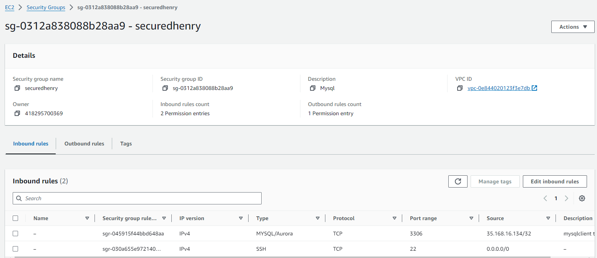
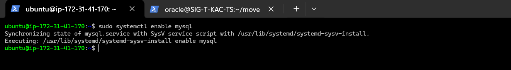
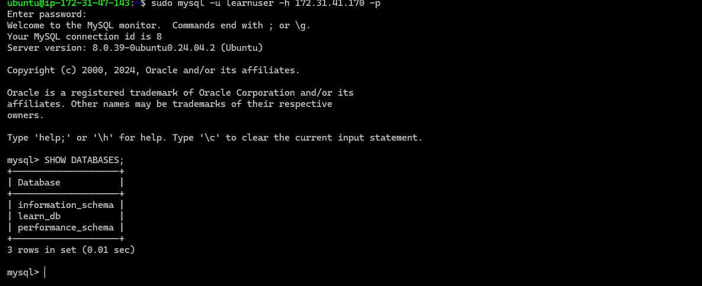

# Task: Implement a Client-Server Architecture with MySQL Database Management System (DBMS)

## Instructions Followed:

### Step 1: Create and Configure Two Linux-Based Virtual Servers (EC2 Instances on AWS)

- **mysql server**
- **mysql client**

1. Two EC2 instances of type `t2.micro` running Ubuntu 24.04 LTS (HVM) were launched in the us-east-1 region through the AWS Management Console.

   - **MySQL Server** instance:
     

   - **MySQL Client** instance:
     

2. The security groups for both instances were configured with default inbound rules allowing SSH access on port 22, with the source set to 'Anywhere.'

   - Security rule for **MySQL Server/Client**:
     


3. An SSH key, named `henrylearndevops`, was attached to both instances to enable secure access via SSH on port 22.

---

### Step 2: Install MySQL Server on the `mysql server` Instance

1. Use the private SSH key to connect to the `mysql server` instance.

   ```bash
   ssh -i "henrylearndevops.pem" ubuntu@<server-ip-address>
   ```

   Replace `<server-ip-address>` with the public IP address of your MySQL server (e.g., `18.209.172.8`).

   

2. **Update and Upgrade the Ubuntu Server**

   Run the following command to ensure that the server packages are up-to-date:
   ```bash
   sudo apt update && sudo apt upgrade -y
   ```
   

3. **Install MySQL Server Software**

   Install MySQL by executing the following:
   ```bash
   sudo apt install mysql-server -y
   ```
   

4. **Enable MySQL Service**

   Enable MySQL to start automatically on boot:
   ```bash
   sudo systemctl enable mysql
   ```
   

---

### Step 3: Install MySQL Client on the `mysql client` Instance

1. **Connect to the `mysql client` Instance**

   Use the same private SSH key to connect to the MySQL client instance:

   ```bash
   ssh -i "henrylearndevops.pem" ubuntu@<client-ip-address>
   ```

   Replace `<client-ip-address>` with the public IP of the client instance (e.g., `35.168.16.134`).

   

2. **Update and Upgrade the Ubuntu Client**

   Similar to the server, update the client instance to ensure it's up-to-date:

   ```bash
   sudo apt update && sudo apt upgrade -y
   ```
   

3. **Install MySQL Client Software**

   Install the MySQL client software on this instance:

   ```bash
   sudo apt install mysql-client -y
   ```
   


### Step 4: Connect to the `mysql server` Using its Local IP Address from the `mysql client`

Since both EC2 instances are in the same local virtual network, they can communicate using their internal IP addresses. To connect the `mysql client` to the `mysql server`, the server's internal IP address is used. MySQL listens on **TCP port 3306** by default, so this port must be opened by adjusting the security group's inbound rules for the `mysql server`. 

For added security, access to the `mysql server` is restricted to the specific internal IP address of the `mysql client`, rather than allowing access from all IP addresses.


---

### Step 5: Configure the MySQL Server to Accept Remote Connections

Before allowing remote connections, the following configuration steps were completed:

1. **Run MySQL Security Script**

   The MySQL security installation script was executed on the `mysql server` to enhance its security:

   ```bash
   sudo mysql_secure_installation
   ```

   

2. **Access the MySQL Shell**

   The MySQL shell was accessed with the following command:

   ```bash
   sudo mysql
   ```

   

3. **Create a User and Database on the MySQL Server**

   A user named `client` and a database called `learn_db` were created on the `mysql server`:

   ```sql
   CREATE USER 'learnuser'@'%' IDENTIFIED WITH mysql_native_password BY 'P@ssw0rd1';

   CREATE DATABASE learn_db;

   GRANT ALL ON learn_db.* TO 'learnuser'@'%' WITH GRANT OPTION;

   FLUSH PRIVILEGES;
   ```

   This grants full access to the `learnuser` user for the `learn_db` database from any remote host.

   

4. **Allow Remote Connections to the MySQL Server**

   To allow the MySQL server to accept remote connections, the bind address was modified in the MySQL configuration file. The default address `127.0.0.1` was replaced with `0.0.0.0` to enable connections from any host:

   ```bash
   sudo vim /etc/mysql/mysql.conf.d/mysqld.cnf
   ```

   Locate the following line:
   ```bash
   bind-address = 127.0.0.1
   ```

   Change it to:
   ```bash
   bind-address = 0.0.0.0
   ```

 
   

---

### Step 6: Connect Remotely to the MySQL Server from the `mysql client` Instance

Using the MySQL utility, connect remotely to the `mysql server` database engine without using SSH. The following command is used from the `mysql client`:

```bash
sudo mysql -u learnuser -h 172.31.41.170 -p
```

Replace `172.31.41.170` with the internal IP address of the `mysql server`.


---

### Step 7: Verify the Connection and Perform SQL Queries

Once connected, verify the connection by listing the databases:

```bash
SHOW DATABASES;
```



Next, create a table, insert rows, and query the table as a test:

```sql
CREATE TABLE learn_db.learn_table (
  item_id INT AUTO_INCREMENT,
  content VARCHAR(255),
  PRIMARY KEY(item_id)
);

INSERT INTO learn_db.learn_table (content) VALUES ("I Play Basketball");

INSERT INTO learn_db.learn_table (content) VALUES ("I Play Monopoly");

SELECT * FROM learn_db.learn_table;
```


---

### Conclusion

At this point, the project is successfully completed with a fully functional MySQL client-server setup. This demonstrates the deployment and connection between a MySQL client and a remote MySQL server on separate EC2 instances.