# DevOps Tooling Website Solution

## Introduction

This project implements a DevOps solution comprising the following components:

- **Infrastructure:** AWS
- **Web Server:** Red Hat Enterprise Linux 9
- **Database Server:** Ubuntu Linux with MySQL
- **Storage Server:** Red Hat Enterprise Linux 9 with NFS Server
- **Programming Language:** PHP
- **Code Repository:** GitHub

The architecture diagram for this solution is shown below.

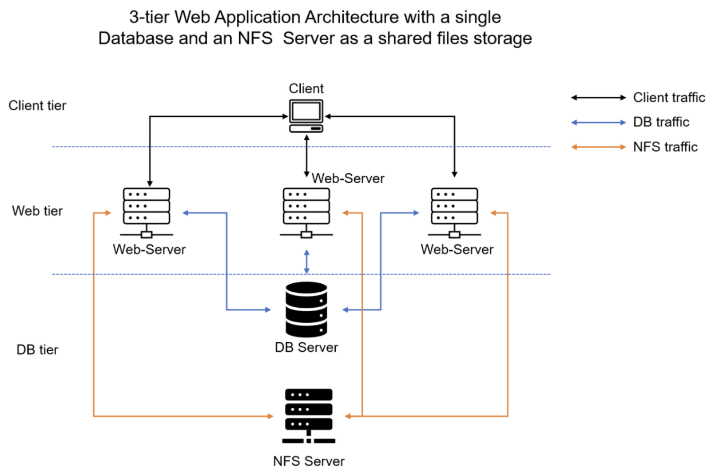

## Step 1 - Prepare the NFS Server

### 1. Launch an EC2 Instance with RHEL Operating System

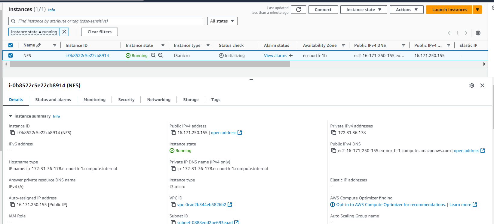

### 2. Configure Logical Volume Management (LVM) on the Server

- Format the LVM as `xfs`.
- Create the following three logical volumes: `lv-opt`, `lv-apps`, and `lv-logs`.
- Mount these logical volumes to the `/mnt` directory as follows:
  - `lv-apps` on `/mnt/apps` – For use by the web servers
  - `lv-logs` on `/mnt/logs` – For storing web server logs
  - `lv-opt` on `/mnt/opt` – For Jenkins server use in a subsequent project

#### Create three 10GB volumes in the same availability zone as the NFS server EC2 instance, and attach all three volumes to the server.

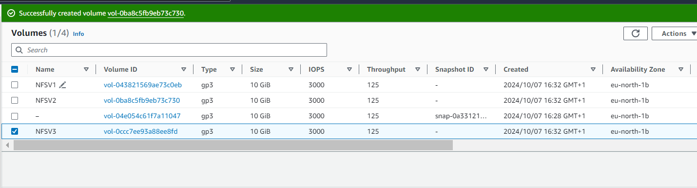

#### Open a terminal and begin configuration by connecting to the EC2 instance via SSH.

```bash
ssh -i "henrylearn.pem" ec2-user@ec2-16-171-250-155.eu-north-1.compute.amazonaws.com
```
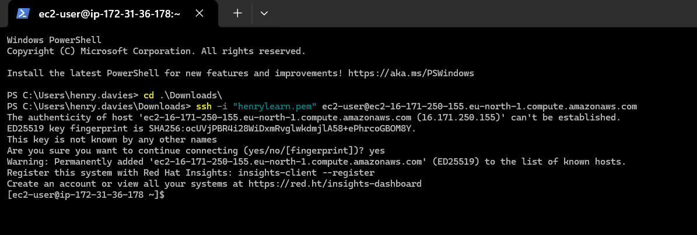

#### Use `lsblk` to verify attached block devices, located in the `/dev/` directory.

```bash
lsblk
```
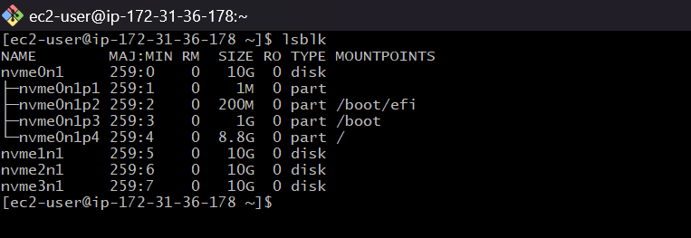

#### Use the `gdisk` utility to create a single partition on each disk.

```bash
sudo gdisk /dev/nvme1n1
```
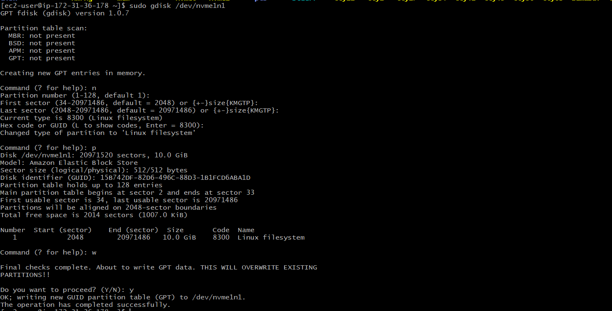

Repeat for the other two disks:
```bash
sudo gdisk /dev/nvme2n1
sudo gdisk /dev/nvme3n1
```
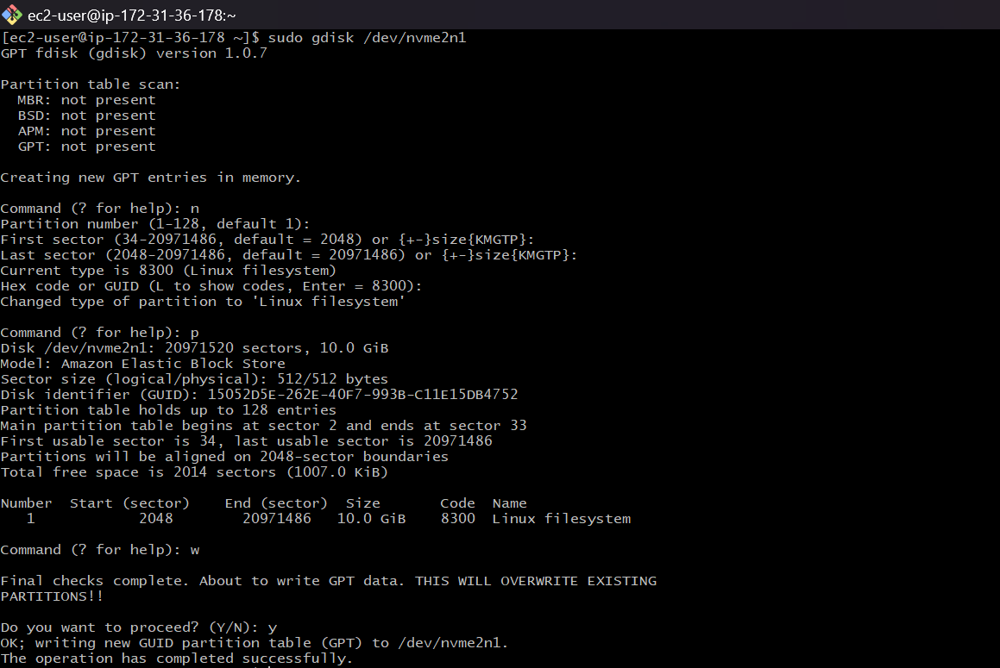

#### Verify partitions on each disk.

```bash
lsblk
```
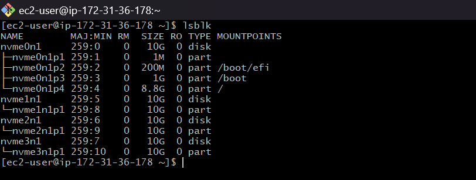

#### Install the `lvm` package.

```bash
sudo yum install lvm2 -y
```
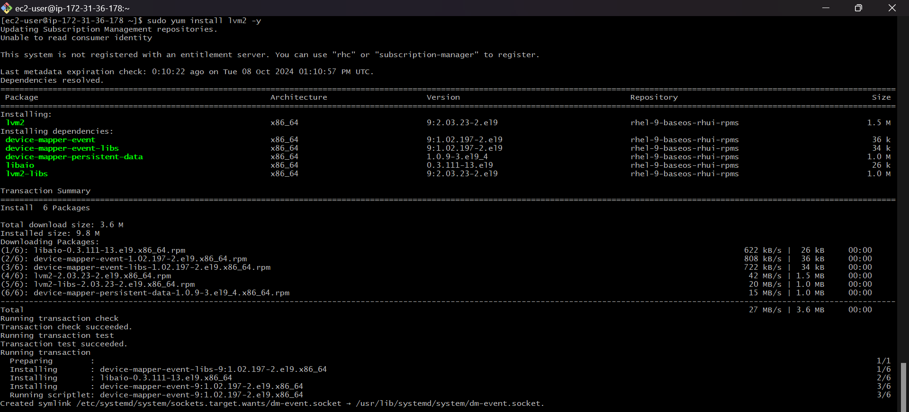

#### Create physical volumes (PVs) for LVM.

```bash
sudo pvcreate /dev/nvme1n1p1 /dev/nvme2n1p1 /dev/nvme3n1p1
sudo pvs
```
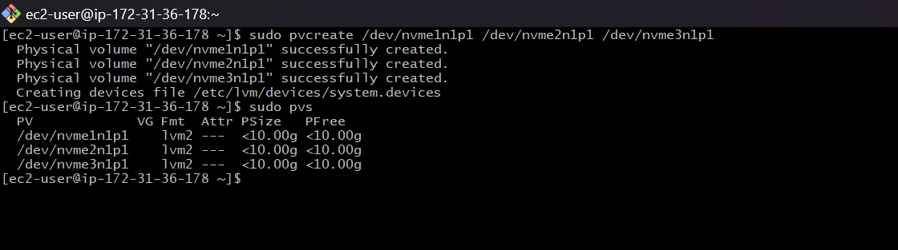

#### Create a volume group (VG) named `webdata-vg` containing all three PVs.

```bash
sudo vgcreate webdata-vg /dev/nvme1n1p1 /dev/nvme2n1p1 /dev/nvme3n1p1
sudo vgs
```
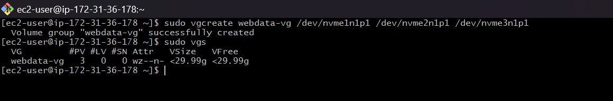

#### Create three logical volumes within the VG.

```bash
sudo lvcreate -n lv-apps -L 9G webdata-vg
sudo lvcreate -n lv-logs -L 9G webdata-vg
sudo lvcreate -n lv-opt -L 9G webdata-vg

sudo lvs
```
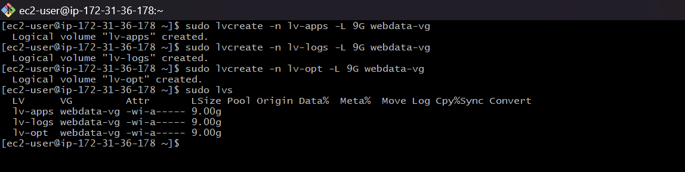

#### Verify the setup with `vgdisplay -v`.

```bash
sudo vgdisplay -v
lsblk
```
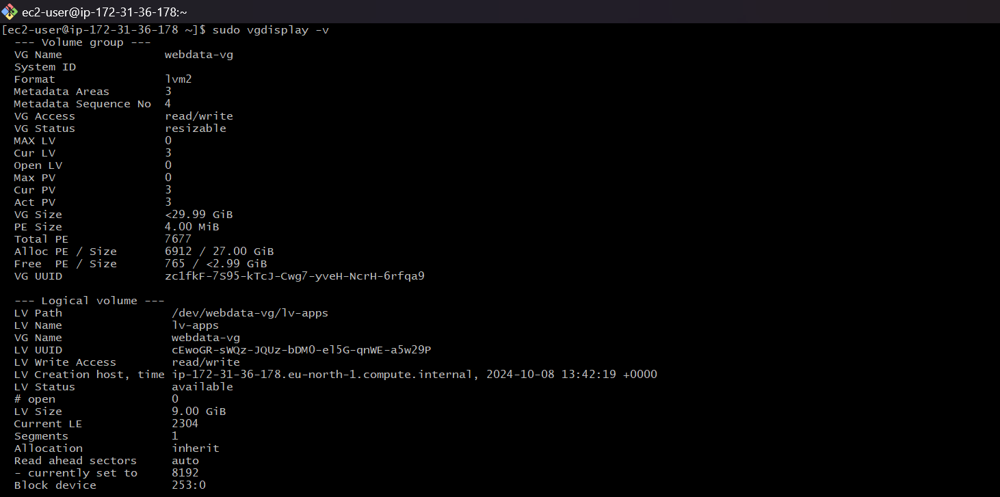
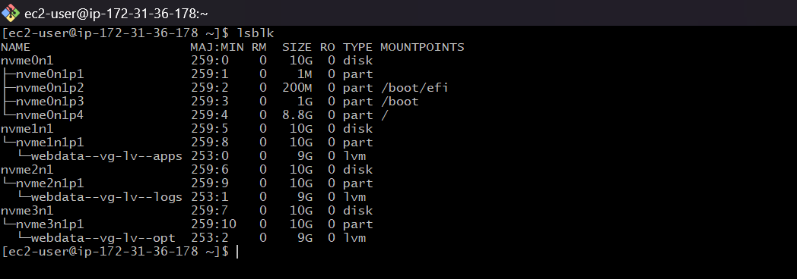

#### Format the logical volumes with the `xfs` filesystem.

```bash
sudo mkfs -t xfs /dev/webdata-vg/lv-apps
sudo mkfs -t xfs /dev/webdata-vg/lv-logs
sudo mkfs -t xfs /dev/webdata-vg/lv-opt
```
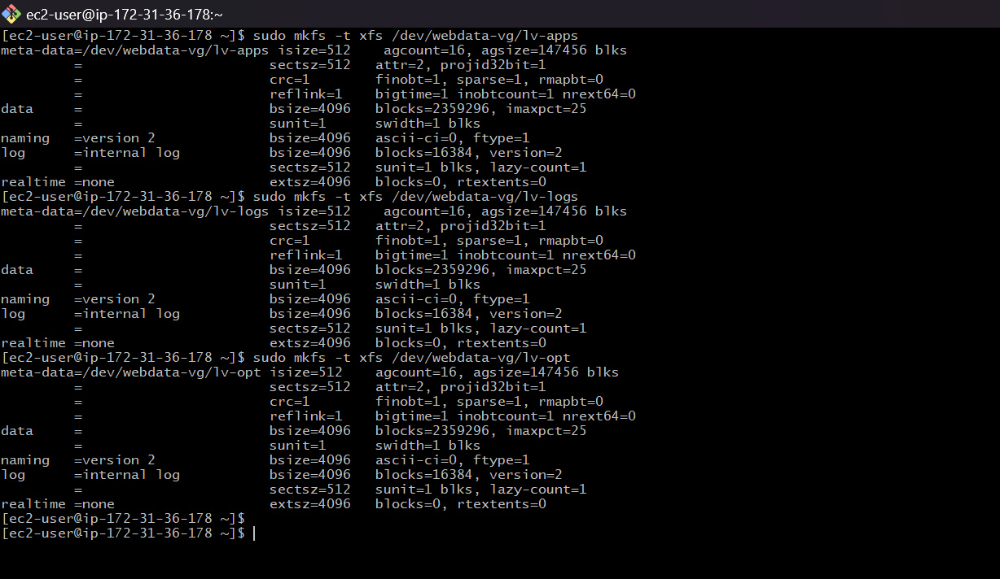

#### Create and mount directories.

```bash
sudo mkdir /mnt/apps /mnt/logs /mnt/opt
sudo mount /dev/webdata-vg/lv-apps /mnt/apps
sudo mount /dev/webdata-vg/lv-logs /mnt/logs
sudo mount /dev/webdata-vg/lv-opt /mnt/opt
```
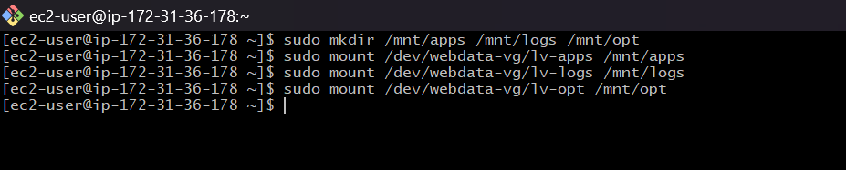

### 3. Install and Start the NFS Server

```bash
sudo yum update -y
sudo yum install nfs-utils -y
```

```bash
sudo systemctl start nfs-server.service
sudo systemctl enable nfs-server.service
sudo systemctl status nfs-server.service
```
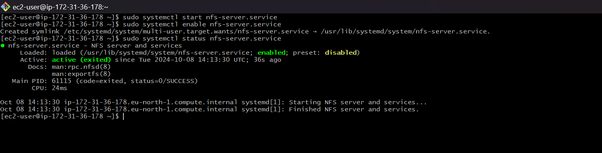

### 4. Export Mounts for Web Server Access

#### Set permissions and restart the NFS server.

```bash
sudo chown -R nobody: /mnt/apps /mnt/logs /mnt/opt
sudo chmod -R 777 /mnt/apps /mnt/logs /mnt/opt
sudo systemctl restart nfs-server.service
```
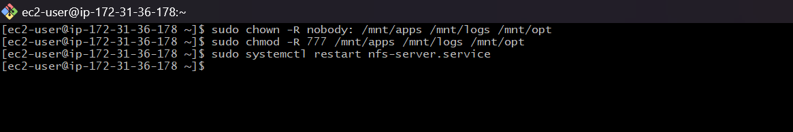

#### Configure access for clients within the same subnet.

```bash
sudo vi /etc/exports

/mnt/apps 172.31.0.0/20(rw,sync,no_all_squash,no_root_squash)
/mnt/logs 172.31.0.0/20(rw,sync,no_all_squash,no_root_squash)
/mnt/opt 172.31.0.0/20(rw,sync,no_all_squash,no_root_squash)

sudo exportfs -arv
```
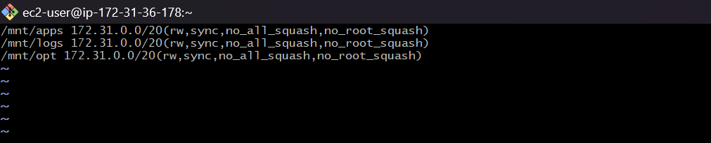
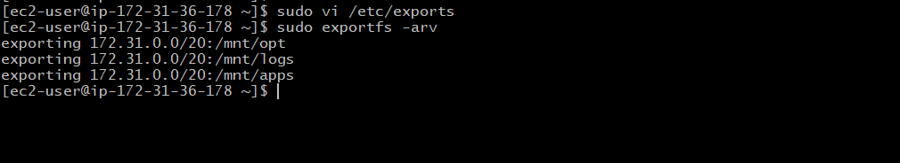

### 5. Check NFS Port and Configure Security Group

```bash
rpcinfo -p | grep nfs
```
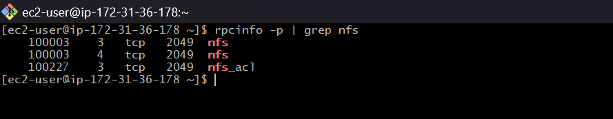

> **Note:** Open the following ports in the security group: TCP 111, UDP 111, UDP 2049, and NFS 2049.

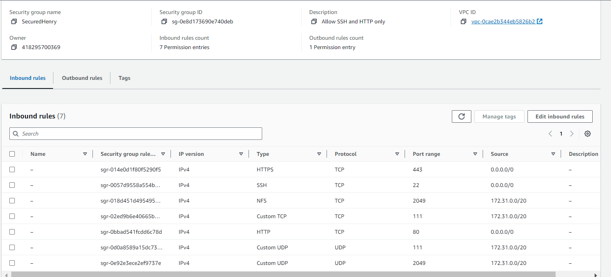


## Step 2 - Configure the Database Server

### 1. Launch an Ubuntu EC2 Instance for the Database Server

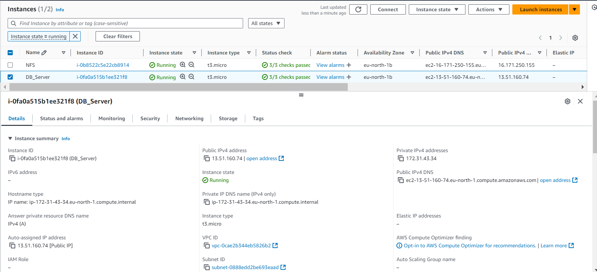

### 2. Access the Instance and Begin Configuration

```bash
ssh -i "henrylearn.pem" ubuntu@ec2-13-51-160-74.eu-north-1.compute.amazonaws.com
```
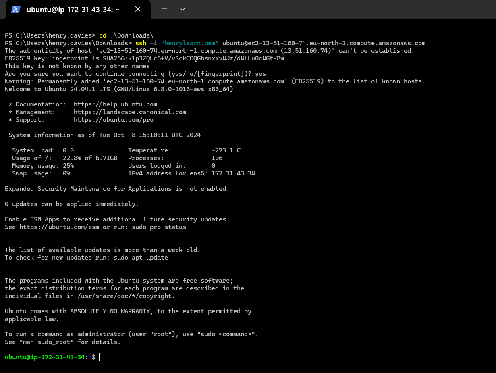

### 3. Update and Upgrade the System

```bash
sudo apt update && sudo apt upgrade -y
```

### 4. Install MySQL Server

#### Install MySQL

```bash
sudo apt install mysql-server
```
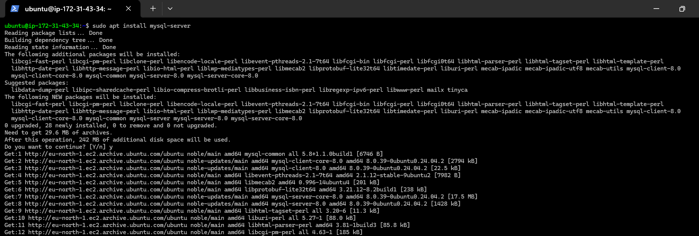

#### Run MySQL Secure Installation Script

```bash
sudo mysql_secure_installation
```


### 5. Configure the MySQL Database

#### Create the `tooling` Database

#### Create a User for Database Access

- **User Name:** `webaccess`
  
#### Grant Permissions to `webaccess` User on `tooling` Database from the Web Server Subnet

```sql
sudo mysql

CREATE DATABASE tooling;
CREATE USER 'webaccess'@'172.31.32.0/20' IDENTIFIED WITH mysql_native_password BY 'P@ssw0rd1';
GRANT ALL PRIVILEGES ON tooling.* TO 'webaccess'@'172.31.32.0/20' WITH GRANT OPTION;
FLUSH PRIVILEGES;

show databases;
use tooling;
select host, user from mysql.user;
exit
```
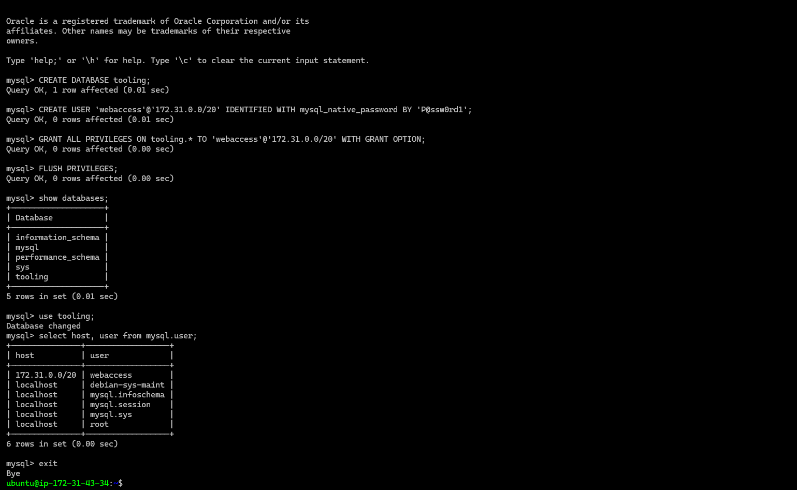

### 6. Set Bind Address and Restart MySQL Service

Update the MySQL configuration file to allow connections from the appropriate subnet and then restart the service.

```bash
sudo vi /etc/mysql/mysql.conf.d/mysqld.cnf

sudo systemctl restart mysql
sudo systemctl status mysql
```
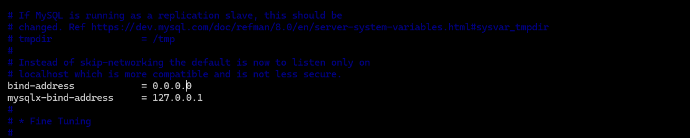
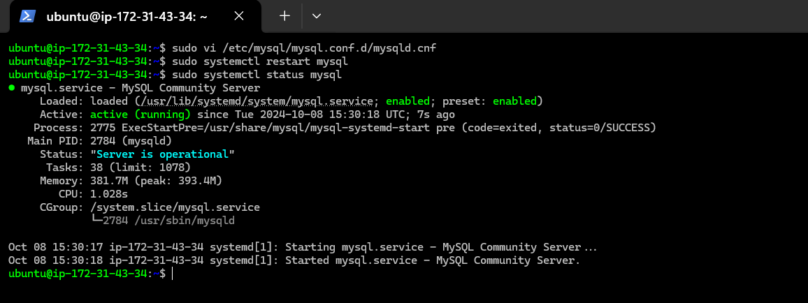

### 7. Open MySQL Port 3306 on the DB Server

Update the security group to allow access to port 3306 from the specified subnet CIDR.

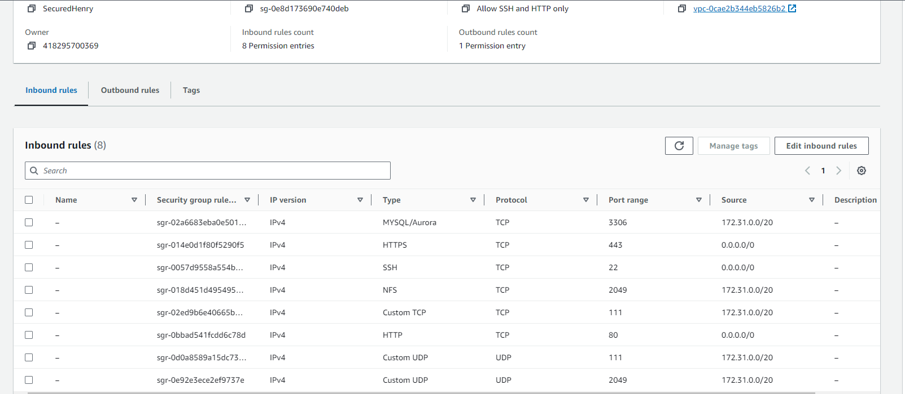


## Step 3 - Prepare the Web Servers

In this step, we configure the web servers to serve content from a shared storage solution using NFS and a MySQL database. This ensures that a single database can handle both `read` and `write` operations for multiple clients. By storing shared files on NFS and mounting the previously created logical volume `lv-apps` to Apache's web directory (`/var/www`), the web servers become stateless, allowing easy replacement without data loss. The database and NFS storage maintain data integrity.

The following steps are carried out:
- Configure NFS (done on all three servers)
- Deploy a tooling application to the web servers via the shared NFS folder
- Configure the web servers to connect to a single MySQL database

### Web Servers

**1. Launch 3 new EC2 instances with the RHEL operating system**

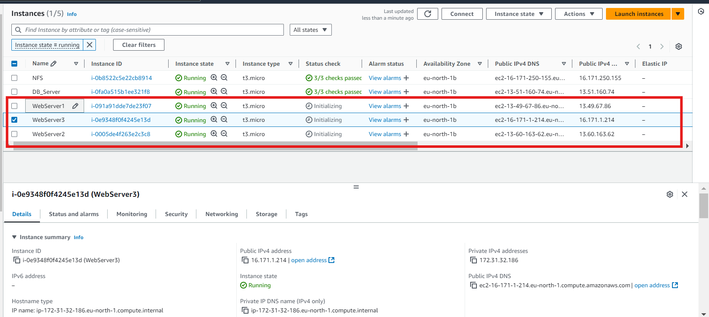

**2. Install NFS Client**

```bash
sudo yum install nfs-utils nfs4-acl-tools -y
```

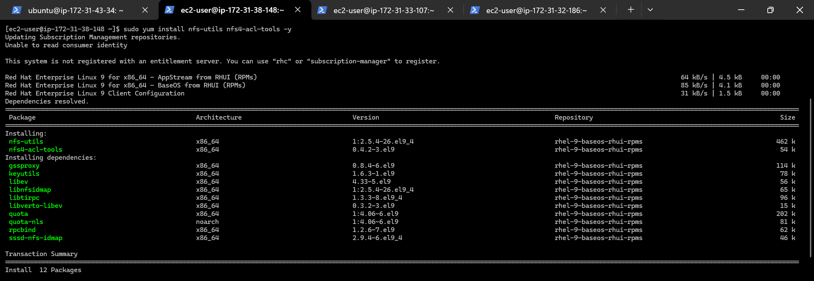

**3. Mount `/var/www/` and point it to the NFS server's export directory for `apps`.**
NFS Server private IP: `172.31.36.178`

```bash
sudo mkdir /var/www
sudo mount -t nfs -o rw,nosuid 172.31.36.178:/mnt/apps /var/www
```

**4. Verify NFS Mount**  
Check the mount with `df -h` and ensure the changes persist after reboot.

```bash
sudo vi /etc/fstab
```

Add the following line:

```bash
172.31.36.178:/mnt/apps /var/www nfs defaults 0 0
```

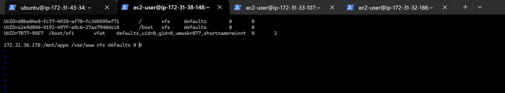

**5. Install Remi’s Repository, Apache, and PHP**

```bash
sudo yum install httpd -y
sudo dnf install https://dl.fedoraproject.org/pub/epel/epel-release-latest-9.noarch.rpm -y
sudo dnf install dnf-utils http://rpms.remirepo.net/enterprise/remi-release-9.rpm -y
sudo dnf module reset php
sudo dnf module enable php:remi-8.2 -y
sudo dnf install php php-opcache php-gd php-curl php-mysqlnd -y
```


Start and enable PHP-FPM:

```bash
sudo systemctl start php-fpm
sudo systemctl enable php-fpm
sudo systemctl status php-fpm
```

Configure SELinux permissions:

```bash
sudo setsebool -P httpd_execmem 1
sudo setsebool -P httpd_can_network_connect=1
sudo setsebool -P httpd_can_network_connect_db=1
```


**6. Verify NFS Mount for Apache Files**  
Ensure that files created on one web server are accessible on the others.  
Create a test file from Web Server 1 and verify it on Web Server 2.

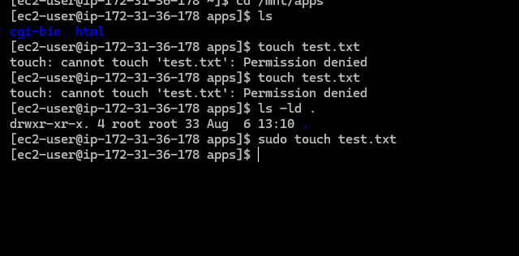
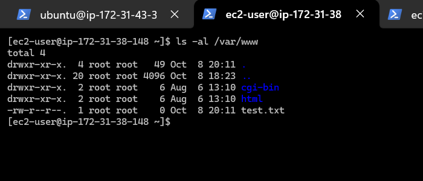

**7. Mount Apache Logs to NFS**  
Mount Apache’s log directory to the NFS server for centralized logging.

```bash
sudo vi /etc/fstab
```

Add the following line:

```bash
172.31.36.178:/mnt/logs /var/log/httpd nfs defaults 0 0
```

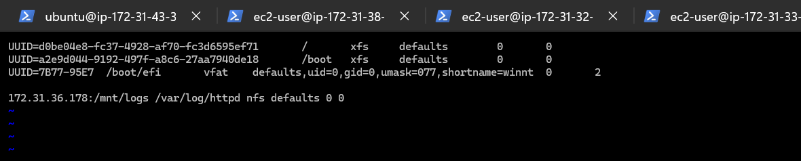


Repeat similar steps on Web Server 2 and 3 to confirm the website is accessible.

**8. Fork the Tooling Source Code from the StegHub GitHub Account**  
Ensure the repository is forked.

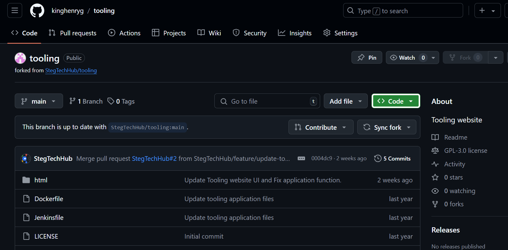

**9. Deploy the Tooling Website**  
Install Git and clone the forked repository to `/var/www/html`.


```bash
sudo yum install git -y
sudo git clone https://github.com/kinghenryg/tooling.git
```

Ensure the HTML folder is deployed to `/var/www/html`.
__Note__:
Acces the website on a browser

- Ensure TCP port 80 is open on the Web Server.
- If ```403 Error``` occur, check permissions to the ```/var/www/html``` folder and also disable ```SELinux```

>give neccesary permision for apache

```bash
sudo chown apache:apache /var/www/html/
```
```bash
sudo setenforce 0
```
To make the change permanent, open selinux file and set selinux to disable.

```bash
sudo vi /etc/sysconfig/selinux

SELINUX=disabled

sudo systemctl restart httpd
```
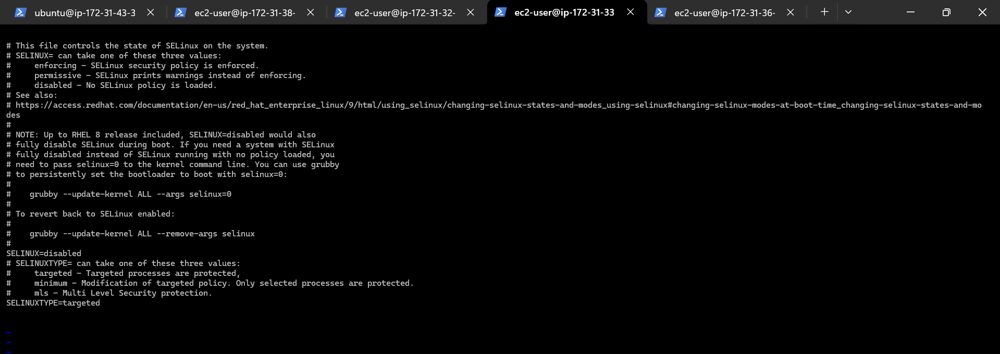

Repeat similar steps on Web Server 2 and 3 to confirm the website is accessible.

**10. Update Website Configuration for MySQL Database**  
Modify the `functions.php` file to connect to the MySQL database, and import the database schema using `tooling-db.sql`.

```bash
sudo vi /var/www/html/functions.php
sudo mysql -h <db-private-IP> -u <db-username> -p <db-password> < tooling-db.sql
```

Verify connectivity:

```bash
sudo mysql -h 172.31.43.3 -u webaccess -p tooling < tooling-db.sql
```

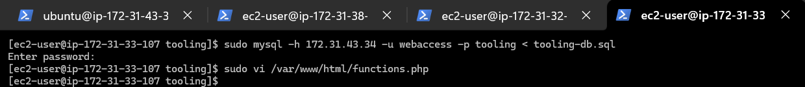

**11. Create Admin User in MySQL**  
Create an admin user in the MySQL database with the following SQL command:

```sql
INSERT INTO users(id, username, password, email, user_type, status) VALUES (2, 'myuser', '5f4dcc3b5aa765d61d8327deb882cf99', 'user@mail.com', 'admin', '1');
```
```sql
INSERT INTO users(id, username, password, email, user_type, status) VALUES (4, 'henryd', 'W1ck3d', 'user@mail.com', 'admin', '1');
```

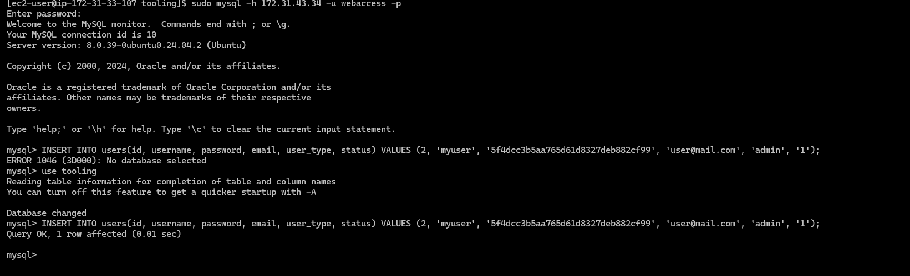

**12. Access the Website**  
Open a browser and visit the public IP of the web server. Log in with the `myuser` credentials.


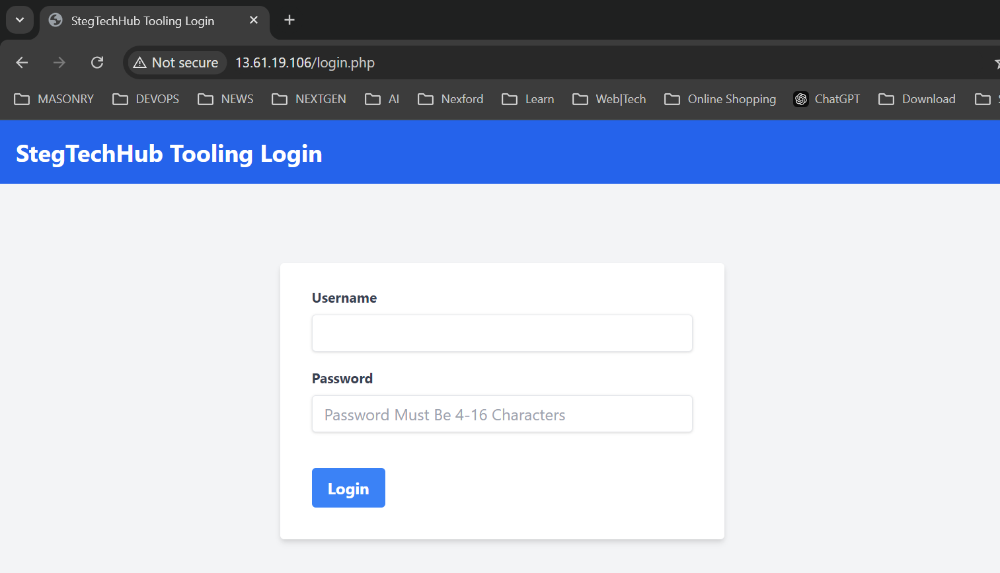
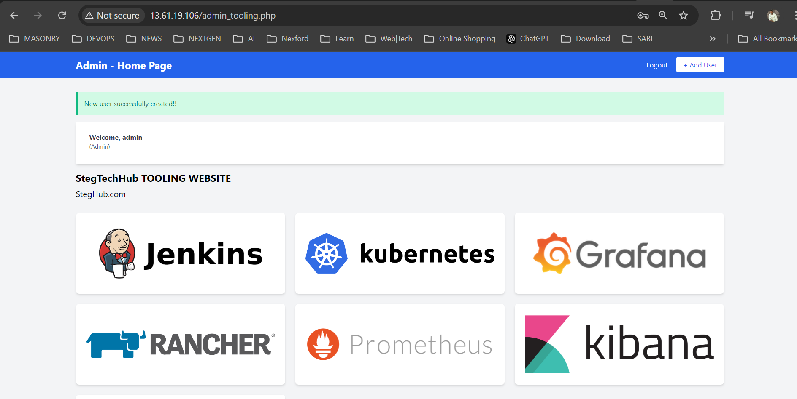

Repeat similar steps on Web Server 2 and 3 to confirm the website is accessible.


