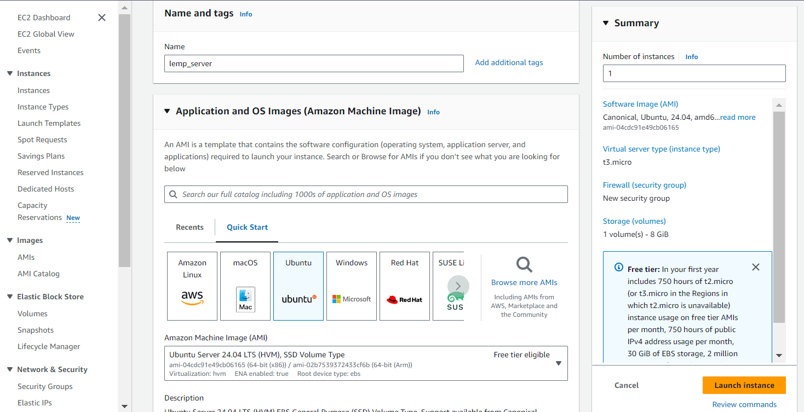
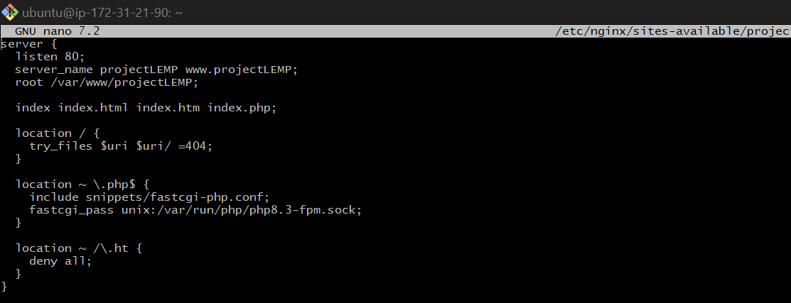
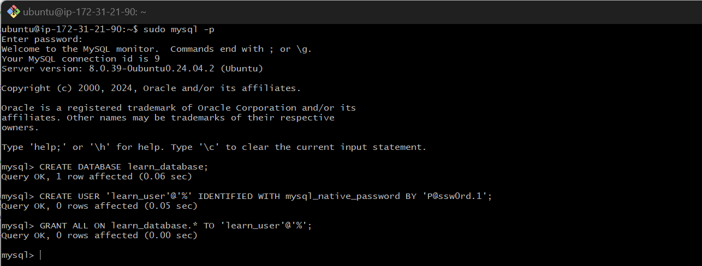

## Web Stack Implementation (LEMP Stack) on AWS

### Introduction:

__The LEMP stack is a popular open-source web development platform consisting of four main components: Linux, Nginx, MySQL, and PHP (or occasionally Perl or Python). This document provides a detailed guide for setting up, configuring, and using the LEMP stack.__

## Step 0: Prerequisites

__1.__ A t2.micro EC2 instance with Ubuntu 24.04 LTS (HVM) was launched in the eu-north-1 region using the AWS Management Console.




__2.__ An SSH key pair named __henrylearndevops__ was created to access the instance via port 22.

__3.__ The security group was configured with the following inbound rules:

- Allow HTTP traffic on port 80 from anywhere on the internet.
- Allow HTTPS traffic on port 443 from anywhere on the internet.
- Allow SSH traffic on port 22 from any IP address (default setting).


__4.__ After downloading the private SSH key, GitBash was used to connect to the instance, using the following command:

```bash
ssh -i "henrylearndevops.pem" ubuntu@ec2-13-53-214-3.eu-north-1.compute.amazonaws.com
```

In this command, __username=ubuntu__ and __public IP address=ec2-13-53-214-3.eu-north-1.compute.amazonaws.com__.


## Step 1 - Install Nginx Web Server

__1.__ **Update and upgrade the server’s package index:**

```bash
sudo apt update
sudo apt upgrade -y
```


__2.__ **Install Nginx:**

```bash
sudo apt install nginx -
```


__3.__ **Verify Nginx is active and running:**

```bash
sudo systemctl status nginx
```
If the status is green and running, Nginx has been successfully installed.


__4.__ **Access Nginx locally via the Ubuntu shell:**

```bash
curl http://127.0.0.1:80 
```
or
```bash
curl http://localhost
```


__5.__ **Test Nginx with the public IP address in a browser:**

```bash
http://13.53.214.3
```


This confirms that the web server is installed correctly and accessible through the firewall.

__6.__ **Retrieve the public IP address (alternative to checking the AWS console):**

```bash
curl -s http://169.254.169.254/latest/meta-data/public-ipv4
```
The command initially provided no response.


__Troubleshooting:__
To resolve this, modify the instance's metadata options in the AWS console:
- Navigate to: Actions > Instance Settings > Modify instance metadata options.
- Change the __IMDSv2__ setting from __Required__ to __Optional__.


Once updated, re-run the command, and the public IP address should be displayed:

```bash
curl -s http://169.254.169.254/latest/meta-data/public-ipv4
```


## Step 2 - Install MySQL

__1.__ **Install a relational database (RDB):**

In this project, MySQL was installed. It is a widely used relational database management system within PHP environments.

```bash
sudo apt install mysql-server
```


__2.__ **Log in to the MySQL console:**

```bash
sudo mysql
```
This command connects to the MySQL server as the administrative user __root__, which is inferred by using `sudo`.


__3.__ **Set a password for the root user using `mysql_native_password` as the default authentication method:**

In this case, the root user password was set to "Passw0rd.1".

```bash
ALTER USER 'root'@'localhost' IDENTIFIED WITH mysql_native_password BY 'Passw0rd.1';
```


Exit the MySQL shell:

```bash
exit
```

__4.__ **Run an interactive script to secure MySQL:**

The security script, which comes pre-installed with MySQL, removes insecure settings and locks down access to the database system.

```bash
sudo mysql_secure_installation
```


__5.__ **After securing the MySQL installation, log in to the MySQL console with the root user:**

A password prompt will appear after executing the command below:

```bash
sudo mysql -u root -p
```


Exit the MySQL shell:

```bash
exit
``` 

## Step 3 - Install PHP

__1.__ __Install php__

Install PHP FastCGI Process Manager (PHP-FPM) and configure Nginx to route PHP requests to it for processing. Additionally, install the PHP-MySQL module, enabling PHP to interact with MySQL-based databases. Core PHP packages will be automatically installed as dependencies.

The following components were installed:
- php-fpm (PHP fastCGI process manager)
- php-mysql

```
sudo apt install php-fpm php-mysql
```

Respond with "y" when prompted.


## Step 4 - Configure Nginx to Use the PHP Processor

__1.__ __Create the web root directory for your project.__

```
sudo mkdir /var/www/projectLEMP
```


__2.__ __Assign ownership of this directory to the current system user.__

```
sudo chown -R $USER:$USER /var/www/projectLEMP
```


__3.__ __Create a new Nginx configuration file in the “sites-available” directory.__

```
sudo nano /etc/nginx/sites-available/projectLEMP
```
Insert the following configuration:

```
server {
  listen 80;
  server_name projectLEMP www.projectLEMP;
  root /var/www/projectLEMP;

  index index.html index.htm index.php;

  location / {
    try_files $uri $uri/ =404;
  }

  location ~ \.php$ {
    include snippets/fastcgi-php.conf;
    fastcgi_pass unix:/var/run/php/php8.1-fpm.sock;
  }

  location ~ /\.ht {
    deny all;
  }
}
```



### Explanation of the Directives:

- __listen__ - Defines the port Nginx listens on, typically port 80 for HTTP.
- __root__ - Specifies the document root directory for serving files.
- __index__ - Sets the priority order for index files, with index.html taking precedence over index.php.
- __server_name__ - Specifies the domain or IP address for which this configuration is valid.
- __location /__ - Checks for matching files or directories, returning a 404 error if none is found.
- __location ~ \.php$__ - Handles PHP file processing using the PHP-FPM service.
- __location ~ /\.ht__ - Denies access to `.htaccess` files for security reasons.

These directives control how Nginx processes requests and handles PHP files.

__4.__ __Activate the configuration by creating a symbolic link to the sites-enabled directory.__

```
sudo ln -s /etc/nginx/sites-available/projectLEMP /etc/nginx/sites-enabled/
```


This command tells Nginx to use the new configuration upon reload.

__5.__ __Test the configuration for syntax errors.__

```
sudo nginx -t
```


__6.__ __Disable the default Nginx site that is currently listening on port 80.__

```
sudo unlink /etc/nginx/sites-enabled/default
```


__7.__ __Reload Nginx to apply the changes.__

```
sudo systemctl reload nginx
```


__8.__ __Create a temporary index.html file to test if the virtual host works.__

```
sudo echo ‘Hello LEMP from hostname’ $(curl -s http://169.254.169.254/latest/meta-data/public-hostname) ‘with public IP’ $(curl -s http://169.254.169.254/latest/meta-data/public-ipv4) > /var/www/projectLEMP/index.html
```


#### Open the website in a browser using your IP address:
```
http://13.53.214.3
```


You can use this as a temporary landing page until you set up the `index.php` file. Afterward, remove or rename the `index.html` file to ensure the `index.php` file is used by default.

The LEMP stack is now fully configured and ready for use.

## Step 5 - Test PHP with Nginx

To verify the LEMP stack, check whether Nginx can correctly process `.php` files.

__1.__ __Create a test PHP file in the document root.__

```
sudo nano /var/www/projectLEMP/info.php
```
Insert the following code:
```
<?php
phpinfo();
?>
```


__2.__ __Access the page in your browser by appending `/info.php` to the IP address or domain name.__
```
http://13.53.214.3/info.php
```


Once you've confirmed the server information, remove this file to prevent exposing sensitive details. You can recreate it later if necessary.
```
sudo rm /var/www/projectLEMP/info.php
```

## Step 6 - Retrieve Data from a MySQL Database Using PHP

### Create a new user with the `mysql_native_password` authentication method to enable PHP to connect to the MySQL database.

First, create a database named `learn_database` and a user named `learn_user`.

__1.__ __Connect to the MySQL console as the root user.__
```
sudo mysql -p
```


__2.__ __Create a new database.__
```
CREATE DATABASE learn_database;
```


__3.__ __Create a new user and grant them full privileges on the database.__
```
CREATE USER 'learn_user'@'%' IDENTIFIED WITH mysql_native_password BY 'P@ssw0rd.1';
```

```
GRANT ALL ON learn_database.* TO 'learn_user'@'%';
```
This command grants all privileges (e.g., SELECT, INSERT, UPDATE) on all tables within the `learn_database` to the `learn_user` account, allowing connections from any host (`%`).


```
exit
```
__4.__ __Log in to the MySQL console using the new user's credentials and verify access to `learn_database`.__

```
mysql -u learn_user -p
```
```
SHOW DATABASES;
```


The `-p` flag prompts for the password you set when creating the `learn_user`.

__5.__ __Create a test table named `learn_list`.__

In the MySQL console, run:
```
CREATE TABLE learn_database.learn_list (
  item_id INT AUTO_INCREMENT,
  content VARCHAR(255),
  PRIMARY KEY(item_id)
);
```

__6.__ __Insert some rows of data into the test table.__
```
INSERT INTO learn_database.learn_list (content) VALUES ("My first important item");

INSERT INTO learn_database.learn_list (content) VALUES ("My second important item");
```


__7.__ __To verify that the data has been saved to the table, run:__
```
SELECT * FROM learn_database.learn_list;
```

```
exit
```

### Create a PHP Script to Connect to MySQL and Query Data

__1.__ __Create a new PHP file in the web root directory__
```
sudo nano /var/www/projectLEMP/learn_list.php
```
This PHP script connects to the MySQL database, retrieves the content of the `learn_list` table, and displays the results in a list. If there's an issue with the database connection, it will throw an exception.

Copy the code below into the `learn_list.php` file:
```
<?php
$user = "learn_user";
$password = "P@ssw0rd.1";
$database = "learn_database";
$table = "learn_list";

try {
  $db = new PDO("mysql:host=localhost;dbname=$database", $user, $password);
  echo "<h2>learn</h2><ol>";
  foreach($db->query("SELECT content FROM $table") as $row) {
    echo "<li>" . $row['content'] . "</li>";
  }
  echo "</ol>";
} catch (PDOException $e) {
    print "Error!: " . $e->getMessage() . "<br/>";
    die();
}
?>
```


__2.__ __Access this page in the browser using the domain name or public IP address followed by /learn_list.php__

```
http://13.53.214.3/learn_list.php
```


__Alternatively, access the page using your domain name followed by /learn_list.php__


### Conclusion

The LEMP stack offers a powerful platform for hosting and serving web applications. By combining Linux, Nginx, MySQL (or MariaDB), and PHP, developers can build scalable and reliable web solutions.
