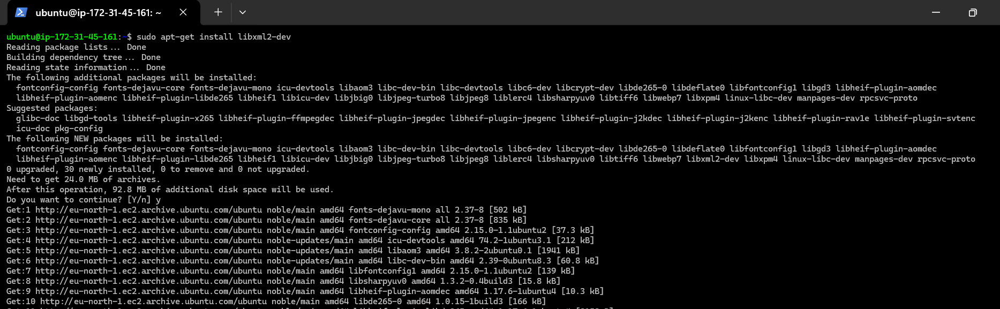
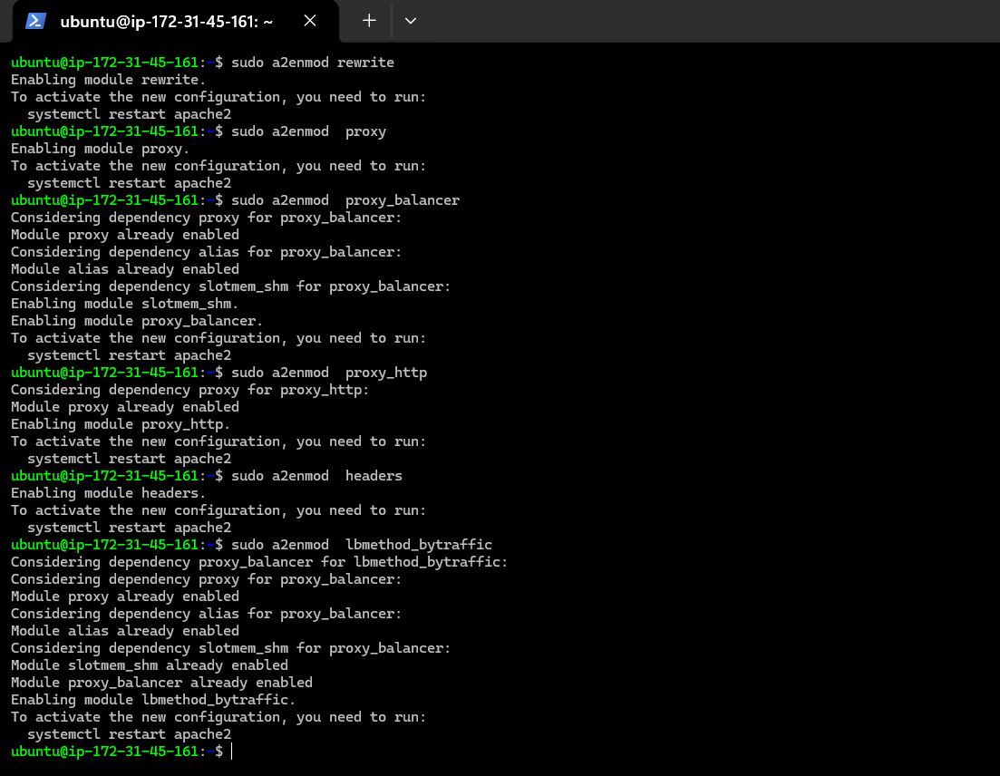

# Load Balancer Solution with Apache

A Load Balancer (LB) effectively distributes client requests among multiple web servers, optimizing resource utilization and ensuring high availability.

The following diagram illustrates the architecture of this solution:


## Task
Deploy and configure an Apache Load Balancer on a separate Ubuntu EC2 instance to serve as the entry point for the Tooling Website solution. This setup should allow users to be seamlessly served by the web servers through the Load Balancer.

## Prerequisites

Ensure that the following servers are installed and configured:

- Two RHEL9 Web Servers
- One MySQL Database Server (Ubuntu 24.04)
- One RHEL9 NFS Server

### Prerequisite Configurations

- Apache (httpd) is operational on both Web Servers.
- The `/var/www` directories on the Web Servers are mounted to `/mnt/apps` on the NFS Server.
- All necessary TCP/UDP ports are open on the Web, DB, and NFS Servers.
- Clients can access both Web Servers by their public IP addresses or DNS names and load the Tooling Website (`http://<Public-IP-or-DNS>/index.php`).

## Step 1 - Configure Apache as a Load Balancer

### 1. Launch an Ubuntu 24.04 EC2 instance and name it `Project-8-apache-lb`


### 2. Open TCP Port 80 on `Project-8-apache-lb` by adding an inbound rule in its Security Group.

### 3. Install and Configure Apache Load Balancer on `Project-8-apache-lb`

#### i. Install Apache2

- Access the instance via SSH:

  ```bash
  ssh -i "henrylearn.pem" ubuntu@ec2-13-60-47-196.eu-north-1.compute.amazonaws.com
  ```
  
  

- Update and upgrade the Ubuntu instance:

  ```bash
  sudo apt update && sudo apt upgrade
  ```
  
  

- Install Apache:

  ```bash
  sudo apt install apache2 -y
  sudo apt-get install libxml2-dev -y
  ```

  
  
  

#### ii. Enable the required Apache modules:

  ```bash
  sudo a2enmod rewrite proxy proxy_balancer proxy_http headers lbmethod_bytraffic
  ```

  

#### iii. Restart the Apache service:

  ```bash
  sudo systemctl restart apache2
  sudo systemctl status apache2
  ```

  

### Configure Load Balancing

#### i. Open the `000-default.conf` file in `sites-available`:

  ```bash
  sudo vi /etc/apache2/sites-available/000-default.conf
  ```

#### ii. Add the following configuration within the `<VirtualHost *:80>` block:

  ```apache
  <Proxy "balancer://mycluster">
      BalancerMember http://172.31.46.157:80 loadfactor=5 timeout=1
      BalancerMember http://172.31.40.78:80 loadfactor=5 timeout=1
      ProxySet lbmethod=bytraffic
  </Proxy>

  ProxyPreserveHost on
  ProxyPass / balancer://mycluster/
  ProxyPassReverse / balancer://mycluster/
  ```

  

#### iii. Restart Apache:

  ```bash
  sudo systemctl restart apache2
  ```

  

The `bytraffic` balancing method will distribute incoming requests between the Web Servers based on the current load. The `loadfactor` parameter controls the traffic distribution ratio.

### 4. Verify the Configuration

#### i. Access the website using the LB's public IP address or DNS name from a browser.

  

  **Note:** If you previously mounted `/var/log/httpd` from the Web Servers to the NFS Server, unmount it and ensure each Web Server has a dedicated log directory.

#### ii. Unmount the NFS directory if necessary:

  ```bash
  df -h
  sudo umount -f /var/log/httpd
  sudo systemctl stop httpd  # Stop services if the directory is busy
  df -h  # Verify unmount
  ```

#### iii. On both Web Servers, monitor access logs:

  ```bash
  sudo tail -f /var/log/httpd/access_log
  ```

  Refresh the browser page to observe incoming requests being distributed across both Web Servers.

## Optional Step - Configure Local DNS Names

For easier server management, configure local DNS names using the `/etc/hosts` file on the Load Balancer.

### i. Open the hosts file and add IP-to-domain mappings:

  ```bash
  sudo vi /etc/hosts
  ```

### ii. Update `000-default.conf` with the custom DNS names:

  ```apache
  BalancerMember http://Web1:80 loadfactor=5 timeout=1
  BalancerMember http://Web2:80 loadfactor=5 timeout=1
  ```

### iii. Test the DNS setup:

  ```bash
  curl http://Web1
  curl http://Web2
  ```


**Note:** This configuration is local to the Load Balancer and does not propagate outside of the instance.

### Conclusion

The `mod_proxy_balancer` module in Apache provides robust load balancing capabilities, including support for multiple algorithms, session stickiness, and health checks. Proper configuration ensures optimal performance, scalability, and reliability for web applications.

