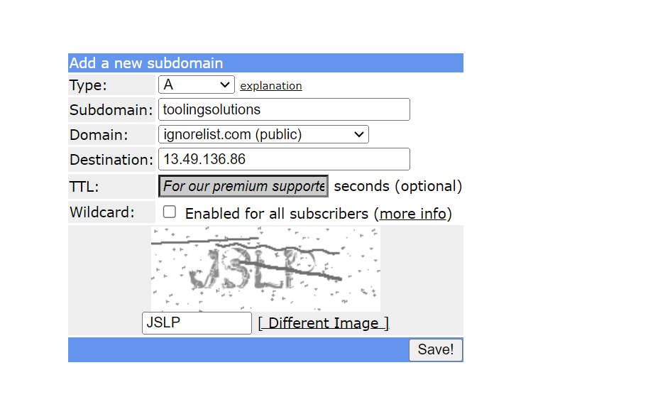

# Load Balancer Solution with Nginx and SSL/TLS

A Load Balancer (LB) distributes client requests across underlying web servers, ensuring optimal load distribution. In this project, we’ll set up an [Nginx](https://www.f5.com/go/product/welcome-to-nginx) Load Balancer solution.

Ensuring secure connections to our web solution is critical, with information being [encrypted in transit](https://security.berkeley.edu/data-encryption-transit-guideline). We will cover the purpose of using secure HTTP (HTTPS) and the requirements for its implementation.

## Project Overview
This project comprises two main parts:
1. Configure Nginx as a Load Balancer
2. Register a domain and set up a secure connection

The following diagram shows the solution architecture:


# Part 1 - Configuring Nginx as a Load Balancer

### Step 1: Set Up an EC2 Instance
- Create an EC2 instance using Ubuntu Server 24.04 LTS and name it nginx LB.


- Open TCP port 80 for HTTP and TCP port 443 for HTTPS connections.

### Step 2: Configure Local DNS with Web Server Names
- Access the EC2 instance.

```bash
ssh -i "henrylearn.pem" ubuntu@ec2-13-60-255-102.eu-north-1.compute.amazonaws.com
```


- Update the `/etc/hosts` file with the local DNS names and IP addresses for the web servers (e.g., `web1` and `web2`).

```bash
sudo vi /etc/hosts
```


### Step 3: Install and Configure Nginx
- Update and install Nginx on the instance.

```bash
sudo apt update && sudo apt upgrade -y
sudo apt install nginx -y
```


### Step 4: Configure Nginx as a Load Balancer
- Open the default Nginx configuration file and add the load balancer configuration.

```bash
sudo vi /etc/nginx/nginx.conf
```

```nginx
upstream myproject {
   server web1 weight=5;
   server web2 weight=5;
}

server {
    listen 80;
    server_name ww.domain.com;

    location / {
        proxy_pass http://myproject;
    }
}
# Comment out this line
# include /etc/nginx/sites-enabled/
```


- Test and restart Nginx.

```bash
sudo nginx -t
sudo systemctl restart nginx
sudo systemctl status nginx
```


# Part 2 - Domain Registration and Secure Connection Setup

To obtain a valid SSL certificate, register a domain with a registrar like [GoDaddy](https://www.godaddy.com/en-uk), [Domain.com](https://www.domain.com/), or [Bluehost](https://www.bluehost.com/). This example uses [FreeDNS](https://freedns.afraid.org/).

### Step 1: Register a Domain Name
- Register a domain with your chosen registrar.


### Step 2: Assign an Elastic IP and Associate with Domain
- Attach an Elastic IP to the Nginx LB instance to maintain a static IP.


### Step 3: Update the DNS A Record
- Create or update the A record at your registrar to point to the Elastic IP.



- Verify the DNS record with [DNS Checker](https://dnschecker.org/#A/toolingsolutions.ignorelist.com).


### Step 4: Update Nginx with Your Domain Name
- Update `nginx.conf` to reflect your domain.

```bash
sudo vi /etc/nginx/nginx.conf
```


- Restart Nginx.

```bash
sudo systemctl restart nginx
```

- Verify access to your website using the new domain over HTTP.


### Step 5: Install Certbot and Request an SSL/TLS Certificate
- Install `snapd` and `certbot`.

```bash
sudo systemctl status snapd
sudo snap install --classic certbot
```


- Obtain an SSL/TLS certificate.

```bash
sudo ln -s /snap/bin/certbot /usr/bin/certbot
sudo certbot --nginx
```


- Verify secure access to your website using HTTPS.


### Step 6: Set Up Periodic Renewal of SSL/TLS Certificate
- Test renewal in dry-run mode.

```bash
sudo certbot renew --dry-run
```


- Schedule a cron job for periodic renewal.

```bash
crontab -e
```
```cron
* */12 * * * root /usr/bin/certbot renew > /dev/null 2>&1
```


For additional resources on cron jobs, refer to:
- [Job Scheduling on Linux](https://www.youtube.com/watch?v=4g1i0ylvx3A)
- [Cron Expression Editor](https://crontab.guru/)