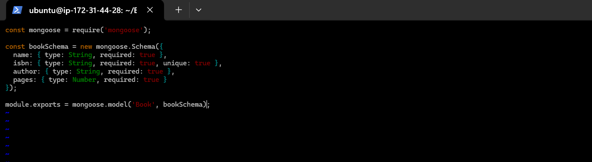

# MEAN STACK IMPLEMENTATION GUIDE

## Introduction

The MEAN stack is a widely-used JavaScript-based technology stack for building dynamic web applications. It consists of the following components:

- **MongoDB:** A NoSQL database that stores data in a flexible, JSON-like format. MongoDB is highly scalable and performs well for web applications due to its flexibility and performance.
  
- **Express.js:** A minimal and flexible Node.js web application framework that provides robust features for building web applications and APIs. It simplifies the development process by offering features like routing, middleware, and templating.

- **AngularJS (or Angular):** A front-end JavaScript framework developed by Google, designed for building dynamic web applications. Angular extends HTML with additional attributes, allowing developers to create interactive user interfaces using the MVC (Model-View-Controller) architecture.

- **Node.js:** A JavaScript runtime environment built on Chrome's V8 engine. It enables developers to execute JavaScript code server-side, making it ideal for building scalable, high-performance applications using an event-driven, non-blocking I/O model.

## Step 0: Prerequisites

1. **Launching the EC2 Instance:**
   - An EC2 instance (t3.micro) with Ubuntu 24.04 LTS(HVM) was launched in the us-east-1 region via the AWS console.
   
   
   

2. **SSH Key Attachment:**
   - An SSH key named *henrylearndevops** was attached to securely access the instance via port 22.

3. **Configuring Security Groups:**
   - The security group was set up with the following inbound rules:
     - **Port 80 (HTTP):** Allows traffic from anywhere on the internet.
     - **Port 443 (HTTPS):** Allows secure traffic from any source.
     - **Port 22 (SSH):** Allows SSH access from any IP address.
     - **Port 3300 (Custom TCP):** Allows traffic on port 3300 from any source.
   
   

4. After downloading the private SSH key, Windows Terminal was used to connect to the instance, using the following command:

	```bash
	ssh -i "henrylearndevops.pem" ubuntu@ec2-13-60-53-188.eu-north-1.compute.amazonaws.com
	```

	In this command, __username=ubuntu__ and __public IP address=ec2-13-60-53-188.eu-north-1.compute.amazonaws.com__.

	


## Step 1 - Install Node.js

Node.js is a JavaScript runtime environment built on Chrome’s V8 engine, and it will be used to handle the Express routes and AngularJS controllers in this tutorial.

1. **Update and Upgrade Ubuntu**
   ```bash
   sudo apt update && sudo apt upgrade -y
   ```
   

2. **Add Required Certificates**
   Install the necessary certificates to ensure secure package management:
   ```bash
   sudo apt -y install curl dirmngr apt-transport-https lsb-release ca-certificates
   ```
   

   Add the Node.js source:
   ```bash
   curl -sL https://deb.nodesource.com/setup_18.x | sudo -E bash -
   ```
   

3. **Install Node.js**
   Once the certificates are added, install Node.js using the following command:
   ```bash
   sudo apt-get install -y nodejs
   ```
   

---

## Step 2 - Install MongoDB

For this tutorial, MongoDB will be used to store records with fields such as book name, ISBN number, author, and number of pages.

1. **Download the MongoDB Public GPG Key**
   First, add the GPG key to ensure the authenticity of the MongoDB packages:
   ```bash
   curl -fsSL https://pgp.mongodb.com/server-7.0.asc | sudo gpg --dearmor -o /usr/share/keyrings/mongodb-archive-keyring.gpg
   ```

2. **Add the MongoDB Repository**
   Add the MongoDB repository to your package manager:
   ```bash
   echo "deb [ signed-by=/usr/share/keyrings/mongodb-archive-keyring.gpg ] https://repo.mongodb.org/apt/ubuntu jammy/mongodb-org/7.0 multiverse" | sudo tee /etc/apt/sources.list.d/mongodb-org-7.0.list
   ```
   

3. **Update the Package Database and Install MongoDB**
   After adding the repository, update your server and install MongoDB:
   ```bash
   sudo apt-get update
   ```
   

   Install MongoDB:
   ```bash
   sudo apt-get install -y mongodb-org
   ```
   

4. **Start and Enable MongoDB**
   Start and enable MongoDB to ensure it runs automatically on system startup:
   ```bash
   sudo systemctl start mongod
   sudo systemctl enable mongod
   sudo systemctl status mongod
   ```
   

5. **Install the `body-parser` Package**
   The `body-parser` package is used to handle JSON payloads in HTTP requests:
   ```bash
   sudo npm install body-parser
   ```
   

6. **Create the Project Root Folder**
   Create a project folder named `Books` and initialize it:
   ```bash
   mkdir Books && cd Books
   npm init
   ```
   

7. **Add the `server.js` File**
   Create a new file named `server.js` inside the `Books` folder and add the following code:
   ```bash
   vim server.js
   ```

   Copy and paste the following server code into `server.js`:
   ```javascript
   const express = require('express');
   const bodyParser = require('body-parser');
   const mongoose = require('mongoose'); // Ensure mongoose is installed
   const path = require('path'); // For serving static files
   const app = express();

   // Connect to MongoDB
   mongoose.connect('mongodb://localhost:27017/test', { useNewUrlParser: true, useUnifiedTopology: true })
     .then(() => console.log('MongoDB connected'))
     .catch(err => console.error('MongoDB connection error:', err));

   // Middleware
   app.use(bodyParser.json());
   app.use(express.static(path.join(__dirname, 'public')));

   // Routes
   require('./apps/routes')(app);

   // Start the server
   app.set('port', 3300);
   app.listen(app.get('port'), () => {
     console.log('Server running at http://localhost:' + app.get('port'));
   });
   ```
   


## Step 3 - Install Express and Set Up Routes to the Server

In this step, we'll set up the backend to handle CRUD operations for our book collection using **Express** and **Mongoose**. Express will handle requests to and from the MongoDB database, while Mongoose provides a schema-based solution for modeling the application data.

### 1. Install Express and Mongoose
First, install the necessary packages, **Express** for handling routes and **Mongoose** for interacting with MongoDB.
```bash
sudo npm install express mongoose
```


---

### 2. Create the Folder Structure for Routes

Create a folder named `apps` inside the `Books` directory to hold the route files and logic.
```bash
mkdir apps && cd apps
```

Now, create a `routes.js` file to define the API routes for handling book data.
```bash
vim routes.js
```

#### Paste the following code into `routes.js`:
```javascript
const Book = require('./models/book');
const path = require('path');

module.exports = function(app) {
  // Get all books
  app.get('/book', async (req, res) => {
    try {
      const books = await Book.find({});
      res.json(books);
    } catch (err) {
      console.error(err);
      res.status(500).json({ error: 'Internal Server Error' });
    }
  });

  // Add a new book
  app.post('/book', async (req, res) => {
    try {
      const book = new Book({
        name: req.body.name,
        isbn: req.body.isbn,
        author: req.body.author,
        pages: req.body.pages
      });
      const result = await book.save();
      res.json({
        message: "Successfully added book",
        book: result
      });
    } catch (err) {
      console.error(err);
      res.status(500).json({ error: 'Internal Server Error' });
    }
  });

  // Update a book by ISBN
  app.put('/book/:isbn', async (req, res) => {
    try {
      const updatedBook = await Book.findOneAndUpdate(
        { isbn: req.params.isbn },
        req.body,
        { new: true }
      );
      if (!updatedBook) {
        return res.status(404).json({ error: 'Book not found' });
      }
      res.json({
        message: "Successfully updated the book",
        book: updatedBook
      });
    } catch (err) {
      console.error(err);
      res.status(500).json({ error: 'Internal Server Error' });
    }
  });

  // Delete a book by ISBN
  app.delete('/book/:isbn', async (req, res) => {
    try {
      const result = await Book.findOneAndRemove({ isbn: req.params.isbn });
      if (!result) {
        return res.status(404).json({ error: 'Book not found' });
      }
      res.json({
        message: "Successfully deleted the book",
        book: result
      });
    } catch (err) {
      console.error(err);
      res.status(500).json({ error: 'Internal Server Error' });
    }
  });

  // Serve static files
  app.get('*', (req, res) => {
    res.sendFile(path.join(__dirname, '../public', 'index.html'));
  });
};
```
This code defines routes for the following operations:
- **GET** `/book`: Retrieve all books.
- **POST** `/book`: Add a new book.
- **PUT** `/book/:isbn`: Update an existing book based on ISBN.
- **DELETE** `/book/:isbn`: Remove a book based on ISBN.
- **GET** `*`: Serve static files (e.g., the front-end).


---

### 3. Create the Model for Book Data

In the `apps` folder, create another folder named `models` to hold the schema definition for the book data.
```bash
mkdir models && cd models
```

Now, create a `book.js` file that defines the book schema for MongoDB.
```bash
vim book.js
```

#### Paste the following code into `book.js`:
```javascript
const mongoose = require('mongoose');

const bookSchema = new mongoose.Schema({
  name: { type: String, required: true },
  isbn: { type: String, required: true, unique: true },
  author: { type: String, required: true },
  pages: { type: Number, required: true }
});

module.exports = mongoose.model('Book', bookSchema);
```

This schema defines the structure for each book, including the book's name, ISBN number, author, and number of pages.




## Step 4: Accessing Routes Using AngularJS

In this section, AngularJS will be used to connect the web page to the Express server and perform operations on the book records.

### 1. Setting Up the Public Directory

Navigate back to the `Books` directory and create a `public` folder where the AngularJS script will be stored.

```bash
cd ../..
mkdir public && cd public
```

Next, create a new file named `script.js` inside the `public` folder:

```bash
vim script.js
```

Copy and paste the following AngularJS code into the `script.js` file. This script defines the controller responsible for handling the book register's actions such as adding, updating, and deleting books.

```javascript
var app = angular.module('myApp', []);

app.controller('myCtrl', function($scope, $http) {
  // Fetch all books from the server
  function getAllBooks() {
    $http({
      method: 'GET',
      url: '/book'
    }).then(function successCallback(response) {
      $scope.books = response.data;
    }, function errorCallback(response) {
      console.error('Error:', response.data);
    });
  }

  // Load books on page initialization
  getAllBooks();

  // Add a new book to the database
  $scope.add_book = function() {
    var body = {
      name: $scope.Name,
      isbn: $scope.Isbn,
      author: $scope.Author,
      pages: $scope.Pages
    };
    $http({
      method: 'POST',
      url: '/book',
      data: body
    }).then(function successCallback(response) {
      console.log('Book added:', response.data);
      getAllBooks();  // Refresh the book list after addition
      // Clear input fields
      $scope.Name = '';
      $scope.Isbn = '';
      $scope.Author = '';
      $scope.Pages = '';
    }, function errorCallback(response) {
      console.error('Error:', response.data);
    });
  };

  // Update an existing book
  $scope.update_book = function(book) {
    var body = {
      name: book.name,
      isbn: book.isbn,
      author: book.author,
      pages: book.pages
    };
    $http({
      method: 'PUT',
      url: '/book/' + book.isbn,
      data: body
    }).then(function successCallback(response) {
      console.log('Book updated:', response.data);
      getAllBooks();  // Refresh the book list after update
    }, function errorCallback(response) {
      console.error('Error:', response.data);
    });
  };

  // Delete a book from the database
  $scope.delete_book = function(isbn) {
    $http({
      method: 'DELETE',
      url: '/book/' + isbn
    }).then(function successCallback(response) {
      console.log('Book deleted:', response.data);
      getAllBooks();  // Refresh the book list after deletion
    }, function errorCallback(response) {
      console.error('Error:', response.data);
    });
  };
});
```

### 2. Creating the HTML Frontend

Inside the `public` folder, create a file named `index.html`:

```bash
vim index.html
```

Paste the following HTML code, which defines the structure of the web interface for the book register. It includes fields for entering book details and buttons for interacting with the book records.

```html
<!DOCTYPE html>
<html ng-app="myApp" ng-controller="myCtrl">
<head>
  <meta charset="UTF-8">
  <meta name="viewport" content="width=device-width, initial-scale=1.0">
  <title>Book Management</title>
  <script src="https://ajax.googleapis.com/ajax/libs/angularjs/1.8.2/angular.min.js"></script>
  <script src="script.js"></script>
  <style>
    body { font-family: Arial, sans-serif; margin: 20px; }
    table { border-collapse: collapse; width: 100%; }
    th, td { border: 1px solid #ddd; padding: 8px; text-align: left; }
    th { background-color: #f2f2f2; }
    input[type="text"], input[type="number"] { width: 100%; padding: 5px; }
    button { margin-top: 10px; padding: 5px 10px; }
  </style>
</head>
<body>
  <h1>Book Management</h1>
  
  <h2>Add New Book</h2>
  <form ng-submit="add_book()">
    <table>
      <tr>
        <td>Name:</td>
        <td><input type="text" ng-model="Name" required></td>
      </tr>
      <tr>
        <td>ISBN:</td>
        <td><input type="text" ng-model="Isbn" required></td>
      </tr>
      <tr>
        <td>Author:</td>
        <td><input type="text" ng-model="Author" required></td>
      </tr>
      <tr>
        <td>Pages:</td>
        <td><input type="number" ng-model="Pages" required></td>
      </tr>
    </table>
    <button type="submit">Add Book</button>
  </form>

  <h2>Book List</h2>
  <table>
    <thead>
      <tr>
        <th>Name</th>
        <th>ISBN</th>
        <th>Author</th>
        <th>Pages</th>
        <th>Action</th>
      </tr>
    </thead>
    <tbody>
      <tr ng-repeat="book in books">
        <td>{{book.name}}</td>
        <td>{{book.isbn}}</td>
        <td>{{book.author}}</td>
        <td>{{book.pages}}</td>
        <td><button ng-click="del_book(book)">Delete</button></td>
      </tr>
    </tbody>
  </table>
</body>
</html>
```

### 3. Running the Server

Finally, return to the `Books` directory and start the server:

```bash
cd ..
node server.js
```


Once the server is running, you can access the Book Register application by navigating to the public IP address or DNS name of your EC2 instance on port `3300` in a web browser.

The web application allows you to add, view, update, and delete book records from the MongoDB database. You can also interact with the app using tools like `curl` for testing API endpoints.

