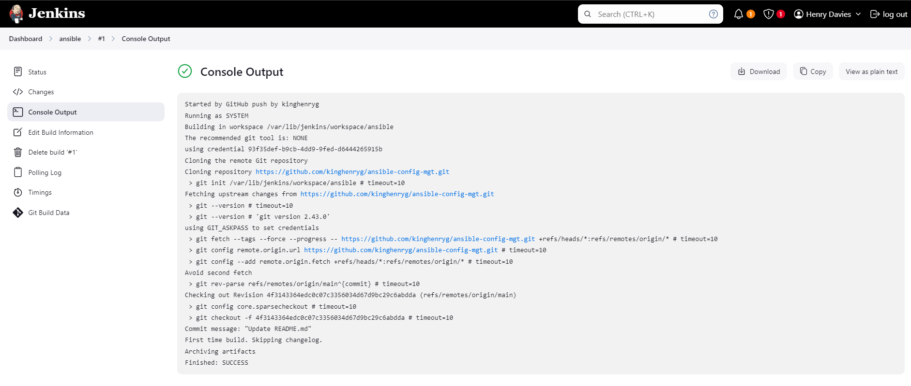

# Ansible Configuration Management (Automate Projects 7 to 10)

In Projects 7 to 10, we manually set up virtual servers, install and configure software, and deploy web applications. This project will deepen your appreciation for DevOps tools by automating many routine tasks using [Ansible Configuration Management](https://www.redhat.com/en/topics/automation/what-is-configuration-management#:~:text=Configuration%20management%20is%20a%20process,in%20a%20desired%2C%20consistent%20state.&text=Managing%20IT%20system%20configurations%20involves,building%20and%20maintaining%20those%20systems). We’ll also build confidence in writing declarative code with YAML.

## Ansible Client as a Jump Server (Bastion Host)

A `Jump Server` (also known as a `Bastion Host`) is an intermediary server that provides access to an internal network. In secure network architectures, web servers reside within a private network that cannot be accessed directly from the Internet. Even DevOps engineers must SSH into the web servers via the Jump Server, enhancing security and reducing attack surfaces.

## Task

- Install and configure Ansible on a Jump Server/Bastion Host.
- Create an Ansible playbook to automate server configuration.

The Virtual Private Cloud (VPC) in the diagram below is divided into two subnets: the public subnet with public IP addresses and the private subnet reachable only by private IP addresses.


## Step 1: Install and Configure Ansible on EC2 Instance

### 1. Update the `Name` tag on your Jenkins EC2 instance to `Jenkins-Ansible`. This server will run playbooks.


### 2. Create a GitHub repository named `ansible-config-mgt`.


### 3. Install Ansible ([See how to install Ansible with pip](https://docs.ansible.com/ansible/latest/installation_guide/intro_installation.html#installing-ansible-with-pip)).

```bash
sudo apt update
sudo apt install ansible
```


Verify the Ansible version:

```bash
ansible --version
```


### 4. Configure a Jenkins build job to save repository content every time it changes. This will enhance the Jenkins configuration skills you acquired in Project 9.

- Set up a webhook in GitHub to trigger the `ansible` build. Go to Settings > Webhooks > Add webhook.


- Create a Freestyle project `ansible` in Jenkins.


- Point the project to the `ansible-config-mgt` repository. Copy the repository URL.


- In the `ansible` project’s configuration, choose `Git` and provide the repository URL and credentials (username/password).


- Configure a post-build job to save all files as done in [Project 9](https://github.com/francdomain/StegHub_DevOps-Cloud_Engineering/blob/main/Tooling-Website-Deployment-Automation-With-CI/Tooling_Website_Deploment_With_CI.md).


### 5. Test the setup by making a change in the `README.md` file on the `main` branch. Ensure the build starts automatically and Jenkins saves the build artifacts.


Check the `ansible` project in Jenkins for the build.


View the console output.



Check the build artifacts:

```bash
ls /var/lib/jenkins/jobs/ansible/builds/<build_number>/archive/
```


__Note__: Trigger Jenkins project execution only for the `/main` (master) branch.

Your setup should look like this:


__Tip__: Allocate an Elastic IP to your Jenkins-Ansible server to avoid having to reconfigure the GitHub webhook each time the server is restarted.


Update the webhook:


__Note__: Elastic IP is free only when allocated to an EC2 instance, so release the Elastic IP after terminating the instance.

## Step 2: Prepare Your Development Environment Using Visual Studio Code

### 1. Install [Visual Studio Code (VSC)](https://code.visualstudio.com/download), a recommended source-code editor for this project.

### 2. Connect VSC to your GitHub repository.

```bash
git clone https://github.com/kinghenryg/ansible-config-mgt.git
```


### 3. Clone the `ansible-config-mgt` repository to your Jenkins-Ansible instance.


## Step 3: Begin Ansible Development

### 1. Create a new branch in the `ansible-config-mgt` repository for feature development.

```bash
git checkout -b feature/prj-11-ansible-config
```


### 2. Create the `playbooks` and `inventory` directories.

```bash
mkdir playbooks
mkdir inventory
```


### 3. In the `playbooks` folder, create a file named `common.yml`.

```bash
touch playbooks/common.yml
```

### 4. In the `inventory` folder, create inventory files for Development, Staging, Testing, and Production environments.

```bash
touch inventory/dev.yml inventory/staging.yml inventory/uat.yml inventory/prod.yml
```


## Step 4: Set Up Ansible Inventory

An inventory file defines hosts and groups of hosts on which commands and tasks in a playbook operate.

__Note__: Ansible uses TCP port 22 to SSH into target servers. Use the [ssh-agent](https://smallstep.com/blog/ssh-agent-explained/) to manage SSH keys.

```bash
eval `ssh-agent -s`
ssh-add <path-to-private-key>
```


Verify that the key is loaded:

```bash
ssh-add -l
```


__SSH into Jenkins-Ansible server__:

```bash
ssh -A ubuntu@public-ip
```


Update the `inventory/dev.yml` file with the following snippet:

```yaml
[nfs]
172.31.36.178 ansible_ssh_user=ec2-user

[webservers]
172.31.46.157 ansible_ssh_user=ec2-user
172.31.40.78 ansible_ssh_user=ec2-user

[db]
172.31.43.34 ansible_ssh_user=ubuntu

[lb]
172.31.39.107 ansible_ssh_user=ubuntu 
```


## Step 5: Create a Common Playbook

In `common.yml`, configure reusable, multi-machine tasks common across your infrastructure.

```yaml
---
- name: Update web and NFS servers
  hosts: webservers, nfs
  remote_user: ec2-user
  become: true
  become_user: root
  tasks:
    - name: Ensure wireshark is at the latest version
      yum:
        name: wireshark
        state: latest

- name: Update LB and DB servers
  hosts: lb, db
  remote_user: ubuntu
  become: true
  become_user: root
  tasks:
    - name: Update apt repo
      apt:
        update_cache: yes

    - name: Ensure wireshark is at the latest version
      apt:
        name: wireshark
        state: latest
```


Add additional tasks like directory creation, timezone changes, or shell script execution.

## Step 6: Update Git with Latest Code

Commit and push your changes to GitHub.

```bash
git add <selected files>
git commit -m "commit message"
git push origin <the feature branch>
```


Create a Pull Request (PR) and merge the changes after review.


Once merged, Jenkins will trigger the build automatically and save the build artifacts.

## Step 7: Run Your First Ansible Test

Configure VS Code for remote development and run the playbook.

```bash
ansible-playbook -i inventory/dev.yml playbooks/common.yml
```


Check if Wireshark was installed on each server

.

```bash
which wireshark

or

wireshark --version
```

Check NFS Server


Check Web Server 1


Check Web Server 2


Check Database Server


check Load Balancer Server


Your updated with Ansible architecture now looks like this:


The installation is complete!

## Optional step - Repeat once again

Update your ansible playbook with some new Ansible tasks and go through the full checkout -> change codes->commit -> PR -> merge -> build -> ansible-playbook cycle again to see how easily you can manage a servers fleet of any size with just one command!

We have just automated our routine tasks by implementing with Ansible configurations.
