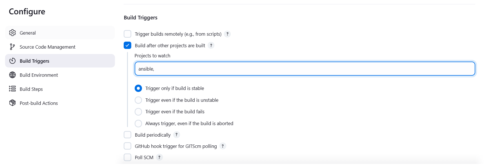

# Ansible Refactoring & Static Assignments (Imports and Roles)

This guide outlines the process of improving and refactoring the Ansible code in the `ansible-config-mgt` repository. The focus is on introducing static assignments and leveraging the `import` functionality to enhance code reuse and maintainability.

---

## Step 1 - Enhancing Jenkins Job

We aim to streamline the Jenkins job by addressing the issues caused by creating separate directories for each build. This consumes excessive space and complicates management. The solution involves setting up a new Jenkins job with the `Copy Artifact` plugin.

1. **Create a Directory for Artifacts**  
   On the `Jenkins-Ansible` server, create a directory to store build artifacts.

   ```bash
   sudo mkdir /home/ubuntu/ansible-config-artifact
   ```

   

2. **Set Permissions for Jenkins**  
   Adjust permissions so Jenkins can write to the directory.

   ```bash
   chmod -R 0777 /home/ubuntu/ansible-config-artifact
   ```

   

3. **Install the `Copy Artifact` Plugin**  
   Navigate to `Manage Jenkins > Manage Plugins > Available` and install the `Copy Artifact` plugin.

   

4. **Create a Freestyle Project**  
   Name it `save_artifacts`, and configure it to be triggered upon the completion of your main Ansible project.

   

5. **Set Up the Build Step**  
   Configure a `Build` step to copy artifacts from the Ansible project to the artifact directory.

   

6. **Test the Setup**  
   Make a change in the `README.md` file of your `ansible-config-mgt` repository and verify that both Jenkins jobs complete successfully, updating the `ansible-config-artifact` directory.

   

   If Jenkins encounters permission issues, resolve them by adding the Jenkins user to the `ubuntu` group:

   ```bash
   sudo chown -R ubuntu:jenkins ansible-config-artifact
   sudo usermod -a -G jenkins ubuntu
   sudo groups ubuntu
   ```

   

   Test again and verify the build succeeds.

   

---

## Step 2 - Refactoring Ansible Code with Imports

### Why Refactor?
Refactoring improves code readability and reusability, especially for larger projects with diverse configurations.

1. **Create `site.yml`**  
   This file will serve as the entry point for all playbooks.

2. **Organize Playbooks**  
   Create a `static-assignments` folder to store imported playbooks. Move `common.yml` to this folder.

   ```bash
   mv common.yml static-assignments/
   ```

   

3. **Update `site.yml`**  
   Import the `common.yml` playbook.

   ```yaml
   ---
   - hosts: all
   - import_playbook: ../static-assignments/common.yml
   ```

4. **Run the Playbook**  
   Execute the playbook against the `dev` inventory.

   ```bash
   ansible-playbook -i inventory/dev.yml playbooks/site.yml
   ```

---

## Step 3 - Configure UAT Webservers with a Role

We will use Ansible roles to configure two UAT web servers.

1. **Launch UAT Servers**  
   Deploy two EC2 instances with RHEL 9, naming them `Web1-UAT` and `Web2-UAT`.

   

2. **Create the Role**  
   Generate a role structure using `ansible-galaxy`:

   ```bash
   mkdir roles
   cd roles
   ansible-galaxy init webserver
   ```

   After cleanup, the structure should look like this:

   ```plaintext
   └── webserver
       ├── defaults/main.yml
       ├── handlers/main.yml
       ├── meta/main.yml
       ├── tasks/main.yml
       └── templates/
   ```

3. **Update Inventory**  
   Add the UAT servers to `inventory/uat.yml`.

   ```yaml
   [uat-webservers]
   <Web1-UAT-Server-Private-IP> ansible_ssh_user='ec2-user'
   <Web2-UAT-Server-Private-IP> ansible_ssh_user='ec2-user'
   ```

   

4. **Configure Role Tasks**  
   Update `tasks/main.yml` to set up Apache and deploy the Tooling website.

   ```yaml
   ---
   - name: install apache
     yum:
       name: httpd
       state: present
     become: yes

   - name: clone tooling repo
     git:
       repo: https://github.com/<your-name>/tooling.git
       dest: /var/www/html
       force: yes
     become: yes

   - name: start apache
     service:
       name: httpd
       state: started
     become: yes
   ```

   

5. **Reference the Role**  
   Create `static-assignments/uat-webservers.yml` to reference the role.

   ```yaml
   ---
   - hosts: uat-webservers
     roles:
       - webserver
   ```

   Update `site.yml` to include the UAT playbook.

   ```yaml
   ---
   - import_playbook: ../static-assignments/common.yml
   - import_playbook: ../static-assignments/uat-webservers.yml
   ```

   

---

## Step 4 - Commit and Test

1. **Commit and Push Changes**  
   Push your changes and ensure Jenkins jobs run successfully.

   

2. **Run the Playbook**  
   Deploy the configuration to UAT servers.

   ```bash
   ansible-playbook -i inventory/uat.yml playbooks/site.yml
   ```

   

3. **Verify Deployment**  
   Access the servers in your browser:

   ```plaintext
   http://<Web1-UAT-Server-IP>/index.php
   http://<Web2-UAT-Server-IP>/index.php
   ```

     
   

---

## Ansible Architecture

The updated architecture ensures organized, reusable, and efficient configuration management.

