# Automating Website Deployment with Continuous Integration Using Jenkins

This project focuses on automating routine deployment tasks using Jenkins, a popular open-source automation server for Continuous Integration and Continuous Deployment (CI/CD).

Continuous Integration (CI) is a development strategy that enhances code quality and accelerates development. Developers frequently commit small code changes, which are automatically built and tested before integration into the shared repository, as defined by CircleCI.

## Project Objective

The goal is to enhance the existing architecture by integrating a Jenkins server. The Jenkins server will be configured to automatically deploy source code changes from a Git repository to an NFS server. The updated architecture is illustrated below:


## Step 1: Jenkins Server Installation

### 1. Launch an AWS EC2 Instance

Create an EC2 instance with Ubuntu Server 24.04 LTS and name it `Jenkins`.

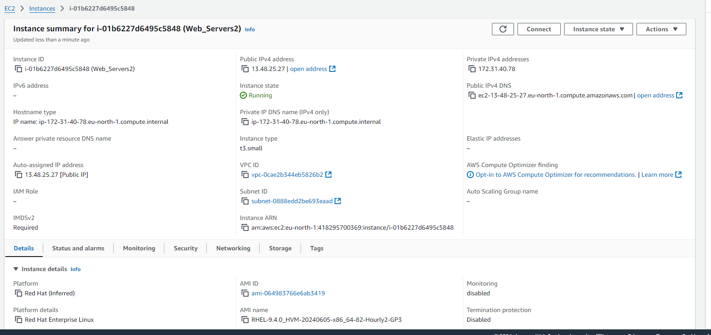

### 2. Install JDK

Connect to the instance and install JDK, as Jenkins is a Java-based application.

```bash
ssh -i "henrylearn.pem" ubuntu@ec2-16-171-133-137.eu-north-1.compute.amazonaws.com
sudo apt-get update
sudo apt install fontconfig openjdk-17-jre
```

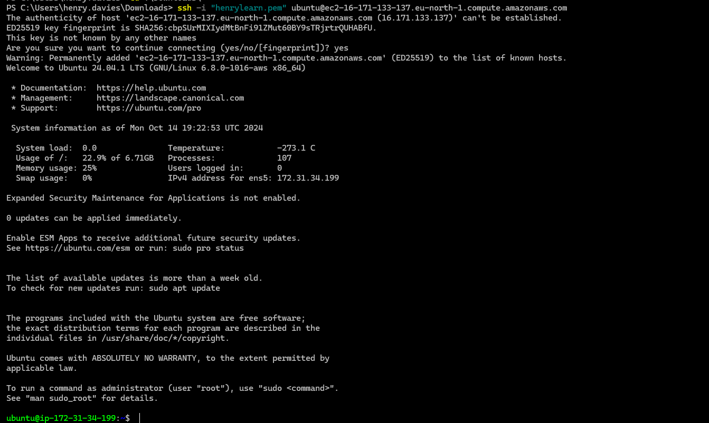

### 3. Install Jenkins

Add the Jenkins repository, update packages, and install Jenkins.

```bash
sudo wget -O /usr/share/keyrings/jenkins-keyring.asc \
  https://pkg.jenkins.io/debian/jenkins.io-2023.key
echo "deb [signed-by=/usr/share/keyrings/jenkins-keyring.asc] \
  https://pkg.jenkins.io/debian binary/" | sudo tee \
  /etc/apt/sources.list.d/jenkins.list > /dev/null
sudo apt-get update
sudo apt-get install jenkins -y
```

Enable and start Jenkins:

```bash
sudo systemctl enable jenkins
sudo systemctl start jenkins
```

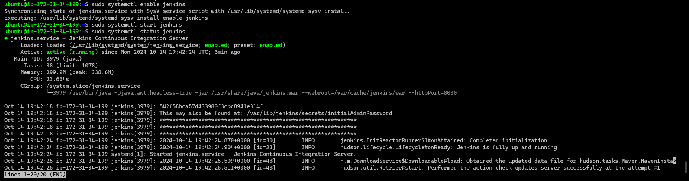

### 4. Configure Security Rules for Port 8080

Open TCP port 8080 in the EC2 Security Group to allow Jenkins access.


### 5. Complete Jenkins Setup

Access Jenkins at `http://<Jenkins-Server-Public-IP-Address>:8080`, and follow the setup instructions.

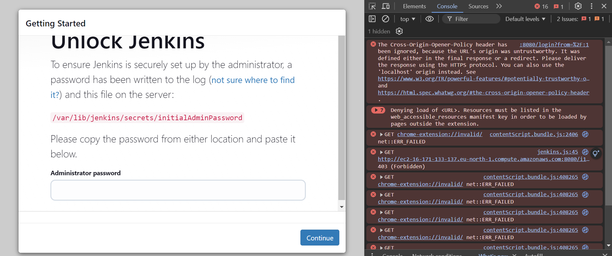
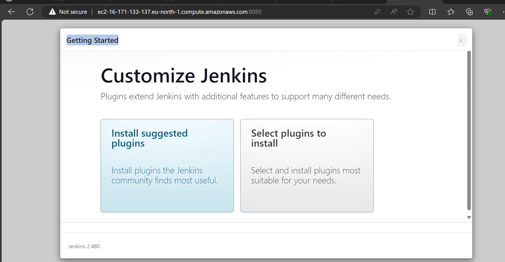


## Step 2: Configure Jenkins for GitHub Integration Using Webhooks

### 1. Enable Webhooks in GitHub Repository

In the GitHub repository, navigate to **Settings > Webhooks > Add webhook**.

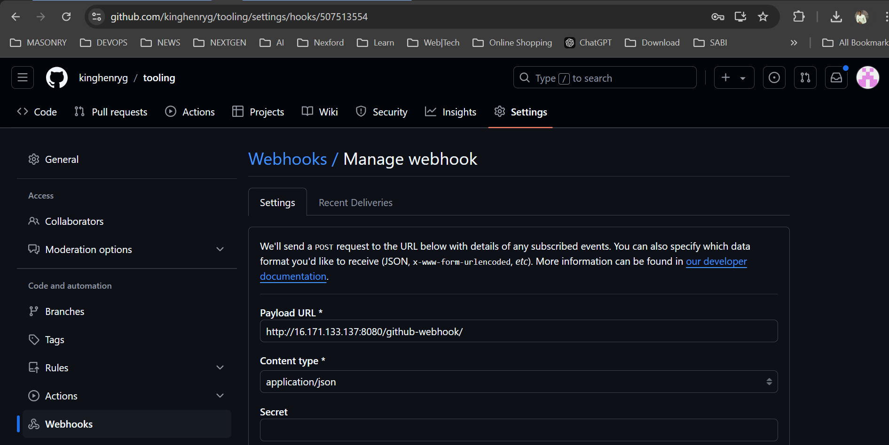

### 2. Create a Jenkins Freestyle Project

From the Jenkins dashboard, click **New Item**, create a **Freestyle Project**, and configure it to pull code from GitHub using the repository URL.


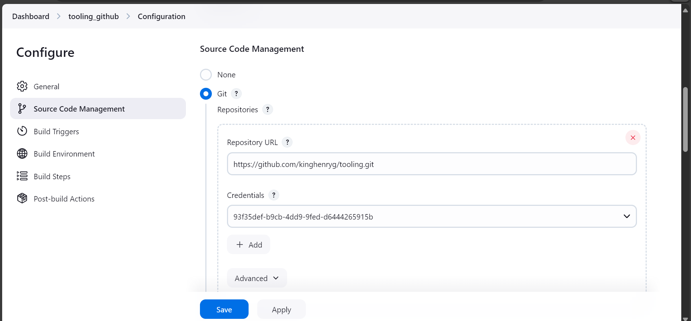

### 3. Configure Build Triggers and Post-Build Actions

Set up GitHub webhook triggering and configure post-build actions to archive files. Push changes to the GitHub repository and validate that Jenkins builds automatically.

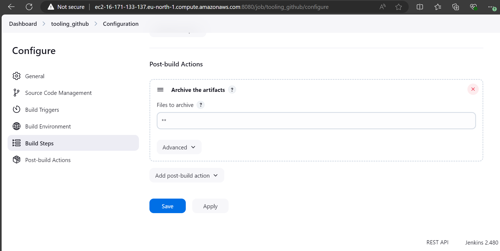
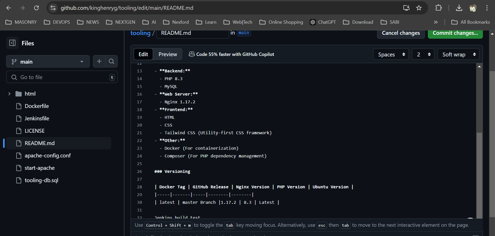
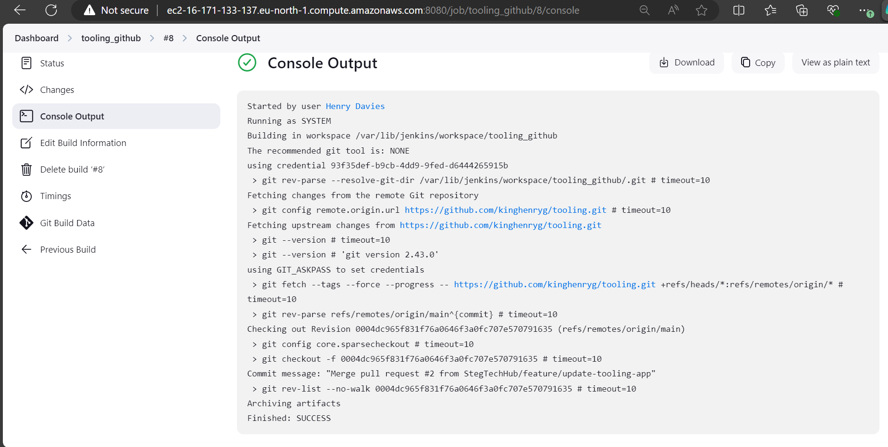

## Step 3: Automate Deployment to the NFS Server Using SSH

### 1. Install Publish Over SSH Plugin

Navigate to **Manage Jenkins > Manage Plugins > Available**, search for and install **Publish over SSH**.

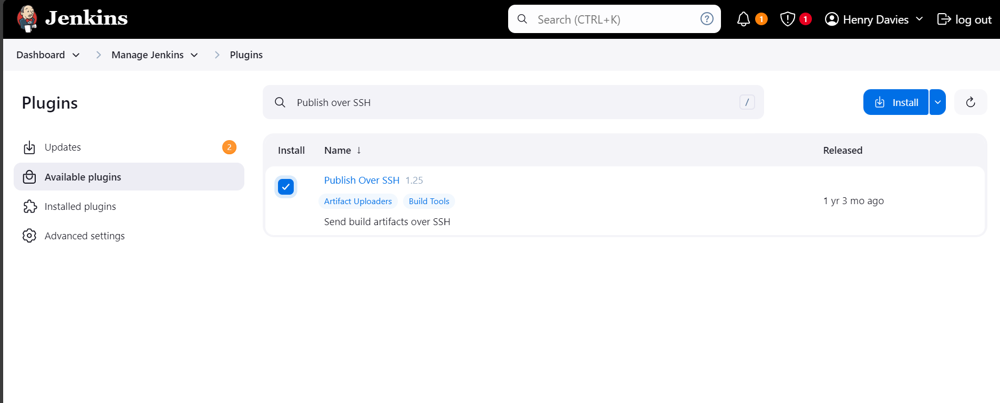
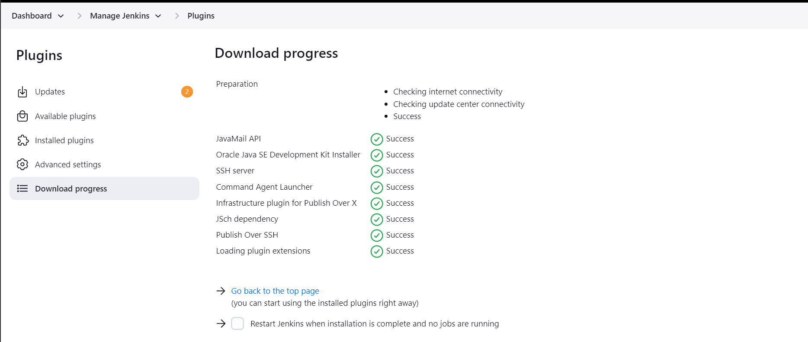

### 2. Configure SSH Transfer to the NFS Server

In **Manage Jenkins > Configure System**, configure the SSH plugin with the NFS server’s details. Set up a post-build action to transfer artifacts to the `/mnt/apps` directory on the NFS server.

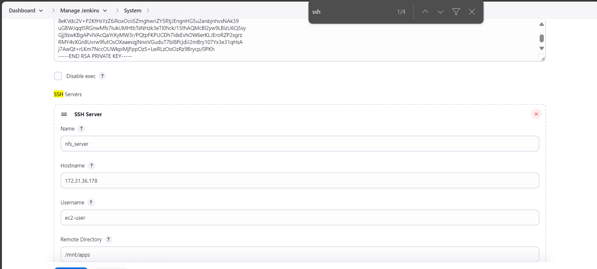
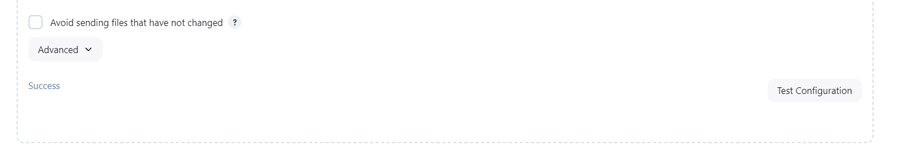

Ensure correct permissions on the NFS server:

```bash
sudo chown -R ec2-user:ec2-user /mnt/apps
sudo chmod -R 777 /mnt/apps
```

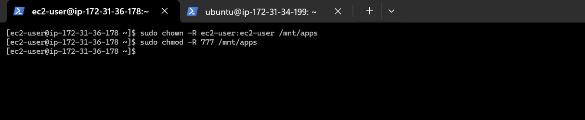

### 3. Verify the Deployment

Connect to the NFS server and check for the transferred artifacts.

```bash
ls -l /mnt/apps
cat /mnt/apps/README.md
```

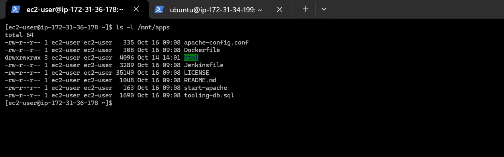
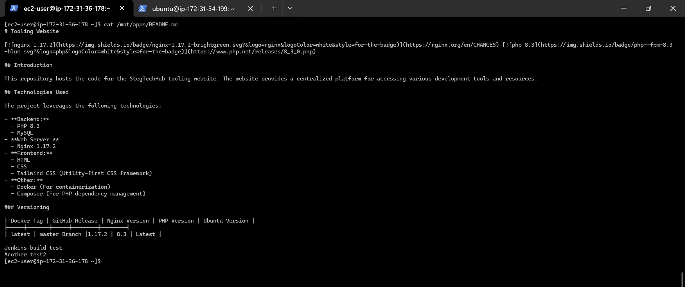

If the README file reflects the changes you made in GitHub, your Jenkins deployment automation is working as expected.