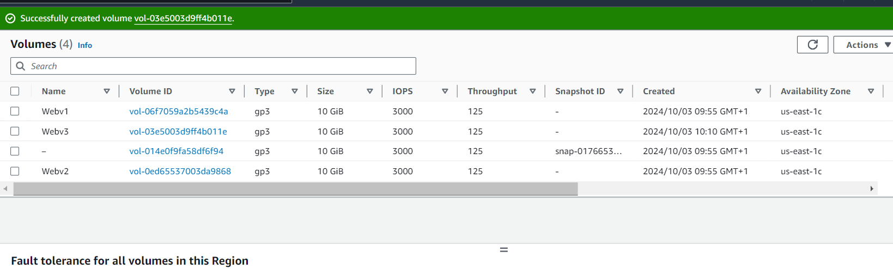
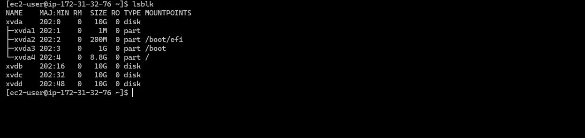
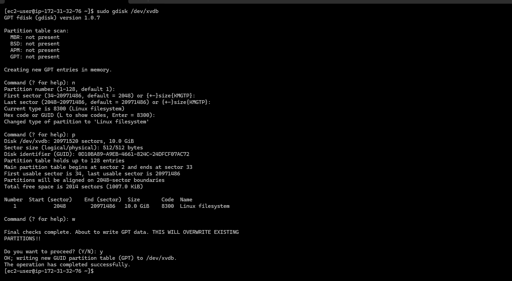
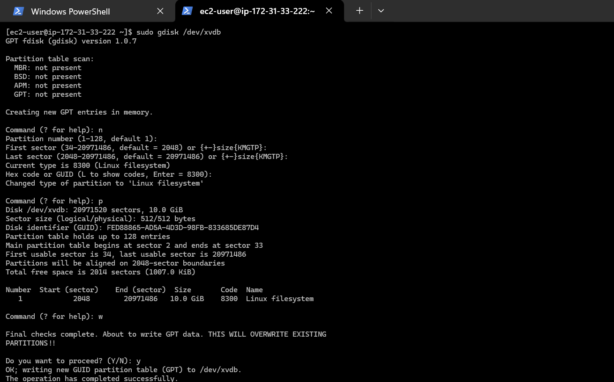
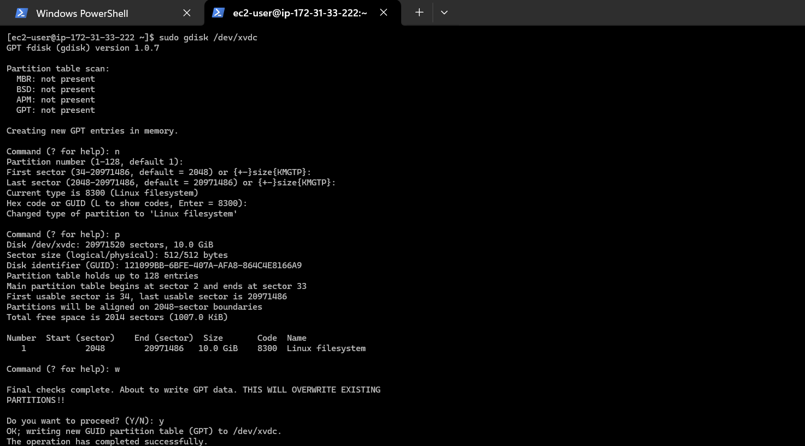
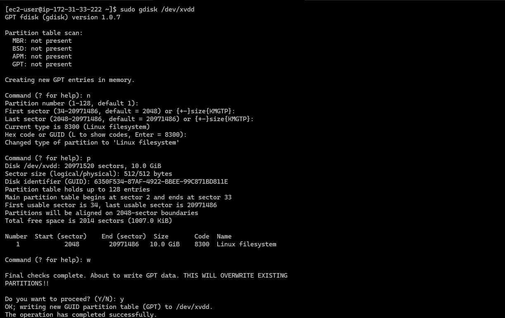
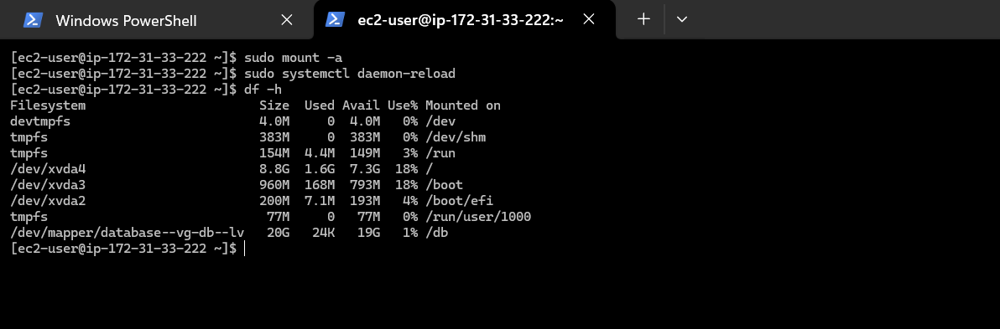
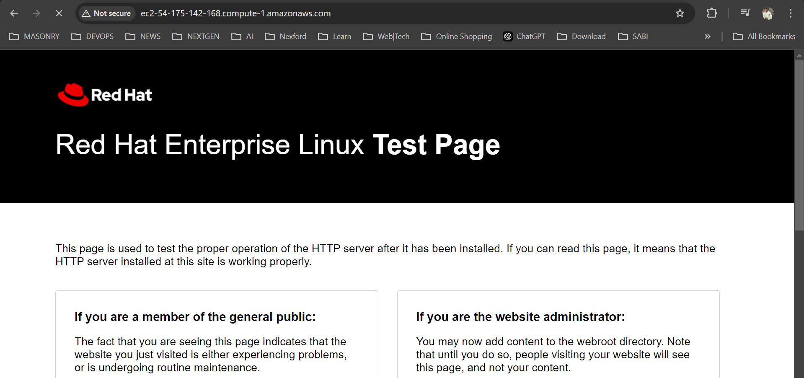

# Web Solution with WordPress

## Step 1 - Preparing the Web Server

1. **Launch a RedHat EC2 instance to serve as the `Web Server`.**  
   Create three volumes (10GB each) in the same availability zone (AZ) as the EC2 instance, then attach all three volumes to the server one by one.

     
     
   

2. **Access the server via SSH.**  
   Open a terminal and SSH into the web server using the following command:

   ```bash
    ssh -i "henrylearndevops.pem" ec2-user@ec2-54-91-31-250.compute-1.amazonaws.com
   ```

   

3. **Inspect attached block devices.**  
   Use the `lsblk` command to list all block devices attached to the server. You can also inspect the `/dev/` directory using `ls /dev/` to ensure the three newly attached devices (likely named `xvdb`, `xvdc`, and `xvdd`) are present.

   ```bash
   lsblk
   ```

   

4. **Check existing mounts and available space.**  
   Use `df -h` to display all mounted devices and their available space.

   ```bash
   df -h
   ```

   

5. **Partition the disks.**  
   Use the `gdisk` utility to create a single partition on each of the three disks:

   - For `/dev/xvdb`:

     ```bash
     sudo gdisk /dev/xvdb
     ```

     

   - For `/dev/xvdc`:

     ```bash
     sudo gdisk /dev/xvdc
     ```

     

   - For `/dev/xvdd`:

     ```bash
     sudo gdisk /dev/xvdd
     ```

     

    > n for new,
    > p for partition,
    > w for write

6. **View the new partitions.**  
   Use `lsblk` to confirm that partitions have been successfully created for each disk.

   ```bash
   lsblk
   ```

   

7. **Install the LVM package.**  
   Install Logical Volume Manager (LVM) using `yum`.

   ```bash
   sudo yum install lvm2 -y
   ```

   

8. **Create Physical Volumes (PVs).**  
   Use the `pvcreate` command to mark each of the three disks as physical volumes (PVs) for LVM. Verify the creation using `pvs`.

   ```bash
   sudo pvcreate /dev/xvdb1 /dev/xvdc1 /dev/xvdd1
   sudo pvs
   ```

   

9. **Create a Volume Group (VG).**  
   Use `vgcreate` to combine the three PVs into a volume group named `webdata-vg`. Confirm its creation using `vgs`.

   ```bash
   sudo vgcreate webdata-vg /dev/xvdb1 /dev/xvdc1 /dev/xvdd1
   sudo vgs
   ```

   

10. **Create Logical Volumes (LVs).**  
    Create two logical volumes (LVs) from the volume group:

    - `apps-lv` (uses half of the available space) for storing website data
    - `logs-lv` (uses the remaining space) for storing log files.

    Verify the creation using `lvs`.

    ```bash
    sudo lvcreate -n apps-lv -L 14G webdata-vg
    sudo lvcreate -n logs-lv -L 14G webdata-vg
    sudo lvs
    ```

    

11. **Verify the setup.**  
    Use `vgdisplay -v` to view the entire setup (VG, PV, and LV), and `lsblk` to confirm the block devices.

    ```bash
    sudo vgdisplay -v
    lsblk
    ```

      
    

12. **Format the logical volumes.**  
    Use `mkfs.ext4` to format the logical volumes with the ext4 filesystem.

    ```bash
    sudo mkfs.ext4 /dev/webdata-vg/apps-lv
    sudo mkfs.ext4 /dev/webdata-vg/logs-lv
    ```

    

13. **Create directories for website and log storage.**  
    Set up directories for storing website files and log backups.

    ```bash
    sudo mkdir -p /var/www/html
    sudo mkdir -p /home/recovery/logs
    ```

#### Mount `/var/www/html` on `apps-lv` Logical Volume
```bash
sudo mount /dev/webdata-vg/apps-lv /var/www/html
```


12. **Backup logs using `rsync`**  
    Use the `rsync` utility to back up all files in the log directory (`/var/log`) to `/home/recovery/logs` before mounting the new filesystem (since mounting will overwrite the existing data).

    ```bash
    sudo rsync -av /var/log /home/recovery/logs
    ```

    

13. **Mount `/var/log` on `logs-lv` Logical Volume**  
    Mount the `/var/log` directory on `logs-lv`. The existing data in `/var/log` will be deleted during this process, which is why the logs were backed up.

    ```bash
    sudo mount /dev/webdata-vg/logs-lv /var/log
    ```

    

14. **Restore log files**  
    Use `rsync` to restore the previously backed-up log files back to the `/var/log` directory.

    ```bash
    sudo rsync -av /home/recovery/logs/log/ /var/log
    ```

    

15. **Persist mount configuration**  
    Update the `/etc/fstab` file so that the mount configuration persists after a server reboot.

    #### Get the UUID of the device and update `/etc/fstab`
    Use the following command to fetch the UUID of the device and update the `/etc/fstab` file accordingly. Ensure that you remove any leading and ending quotes in the UUID.

    ```bash
    sudo blkid  # Fetch the UUID
    sudo vi /etc/fstab
    ```

    

16. **Test the configuration**  
    Test the new configuration and reload the daemon to apply the changes. Verify the setup with the `df -h` command.

    ```bash
    sudo mount -a  # Test the configuration
    sudo systemctl daemon-reload  # Reload the daemon
    df -h  # Verify the setup
    ```

    

---

## Step 2 - Prepare the Database Server

### Launch a second RedHat EC2 instance as the `DB Server`.  
Repeat the same steps as the web server, but instead of creating `apps-lv`, create `db-lv` and mount it to the `/db` directory.

1. **Create 3 volumes (10GB each) in the same AZ as the `DB Server` EC2 instance, and attach them one by one to the DB server.**

      
      
    

2. **SSH into the DB server.**  
    Access the server via SSH:

    ```bash
    ssh -i "henrylearndevops.pem" ec2-user@ec2-54-242-78-13.compute-1.amazonaws.com
    ```

    

3. **Inspect attached block devices.**  
    Use the `lsblk` command to check the block devices attached to the server. They are likely named `xvdb`, `xvdc`, and `xvdd`.

    ```bash
    lsblk
    ```

    

4. **Partition the disks.**  
    Use `gdisk` to create a single partition on each disk:

    - For `/dev/xvdb`:

      ```bash
      sudo gdisk /dev/xvdb
      ```

      

    - For `/dev/xvdc`:

      ```bash
      sudo gdisk /dev/xvdc
      ```

      

    - For `/dev/xvdd`:

      ```bash
      sudo gdisk /dev/xvdd
      ```

      

5. **View the partitions.**  
    Use `lsblk` to verify the newly created partitions on each disk.

    ```bash
    lsblk
    ```

    

6. **Install LVM.**  
    Install the LVM package using `yum`.

    ```bash
    sudo yum install lvm2 -y
    ```

    

7. **Create Physical Volumes and a Volume Group.**  
    Use `pvcreate` to mark the disks as physical volumes (PVs) and `vgcreate` to create a volume group (VG) named `database-vg`. Verify the creation using `pvs` and `vgs`.

    ```bash
    sudo pvcreate /dev/xvdb1 /dev/xvdc1 /dev/xvdd1
    sudo pvs
    sudo vgcreate database-vg /dev/xvdb1 /dev/xvdc1 /dev/xvdd1
    sudo vgs
    ```

    

8. **Create a Logical Volume.**  
    Use `lvcreate` to create a logical volume named `db-lv`, using 20GB of space (as it's the only LV to be created). Verify the setup with `lvs`.

    ```bash
    sudo lvcreate -n db-lv -L 20G database-vg
    sudo lvs
    ```

    

9. **Format and mount the logical volume.**  
    Use `mkfs.ext4` to format the logical volume, and then mount `/db` on `db-lv`.

    ```bash
    sudo mkfs.ext4 /dev/database-vg/db-lv
    sudo mkdir /db
    sudo mount /dev/database-vg/db-lv /db
    ```

    

10. **Update `/etc/fstab` for persistence.**  
    Ensure the mount configuration is added to `/etc/fstab` so it persists after a reboot.


#### Get the UUID of the Device
To retrieve the UUID of the logical volume, use the following command:
```bash
sudo blkid
```


#### Update the `/etc/fstab` File
Edit the `/etc/fstab` file to include the UUID for the logical volume. Ensure you remove any leading and trailing quotes from the UUID.
```bash
sudo vi /etc/fstab
```


10. **Test the Configuration**
   After updating `/etc/fstab`, test the configuration and reload the system daemon. Verify the setup using the following commands:
```bash
sudo mount -a   # Test the configuration
sudo systemctl daemon-reload  # Reload the daemon
df -h   # Verify the setup
```


---

## Step 3 - Install WordPress on the Web Server EC2

1. **Update the Repository**
   Update the system’s package repository to ensure you have the latest packages.
   ```bash
   sudo yum -y update
   ```

2. **Install `wget`, Apache, and its Dependencies**
   Install the necessary packages for Apache and PHP.
   ```bash
   sudo yum install wget httpd php-fpm php-json
   ```
   

3. **Install the Latest Version of PHP and Its Dependencies Using the Remi Repository**
   - **Install the EPEL Repository**
     The package manager `dnf` is used here, offering better performance and dependency resolution than `yum`.

   The system version of the RHEL EC2 is version "9.4".
   ```bash
   sudo dnf install https://dl.fedoraproject.org/pub/epel/epel-release-latest-9.noarch.rpm
   ```

   - **Install Yum Utils and Enable the Remi Repository**
   ```bash
   sudo dnf install dnf-utils http://rpms.remirepo.net/enterprise/remi-release-9.rpm
   ```
   

   - **List Available PHP Modules**
   After the successful installation of `yum-utils` and Remi packages, check for available PHP modules.
   ```bash
   sudo dnf module list php
   ```
   

   - **Reset the PHP Modules**
   If the current version of PHP is 8.1, reset the PHP modules to prepare for a new installation.
   ```bash
   sudo dnf module reset php
   ```

   - **Enable the PHP 8.2 Module**
   Enable the PHP 8.2 module for installation.
   ```bash
   sudo dnf module enable php:remi-8.2
   ```

   - **Install PHP and Related Modules**
   Finally, install PHP, PHP-FPM, and the associated modules.
   ```bash
   sudo dnf install php php-opcache php-gd php-curl php-mysqlnd
   ```
   


#### To verify the version installed to run.

```bash
php -v
```


### 4. Start, Enable, and Check the Status of PHP-FPM

To start PHP-FPM, enable it to run on boot, and check its current status, use the following commands:
```bash
sudo systemctl start php-fpm
sudo systemctl enable php-fpm
sudo systemctl status php-fpm
```


---

### 5. Configure SELinux Policies

To allow Apache to execute PHP code via PHP-FPM, configure SELinux with these commands:

```bash
sudo chown -R apache:apache /var/www/html
sudo chcon -t httpd_sys_rw_content_t /var/www/html -R
sudo setsebool -P httpd_execmem 1
sudo setsebool -P httpd_can_network_connect=1
sudo setsebool -P httpd_can_network_connect_db=1
```


#### Restart Apache Web Server
After configuring SELinux, restart the Apache server to ensure PHP works with Apache:
```bash
sudo systemctl restart httpd
```

#### Test the Apache Setup
Open a web browser and visit the public IP address of the web server to check if the default Apache page is visible.


---

### 6. Download and Set Up WordPress

#### Download WordPress
First, create a directory for WordPress and download the latest version:
```bash
sudo mkdir wordpress && cd wordpress
sudo wget http://wordpress.org/latest.tar.gz
sudo tar xzvf latest.tar.gz  # Extract WordPress
```


#### Configure WordPress
After extracting, change to the WordPress directory, and copy the `wp-config-sample.php` to `wp-config.php`:
```bash
cd wordpress/
sudo cp wp-config-sample.php wp-config.php
```

#### Copy WordPress to `/var/www/html`
Exit the WordPress directory and copy its contents to `/var/www/html`:
```bash
cd ..
sudo cp -R wordpress/. /var/www/html/
```


---

### 7. Install MySQL on the DB Server EC2

#### Update the System
Update the system to get the latest software packages:
```bash
sudo yum update -y
```

#### Install MySQL Server
Next, install MySQL Server:
```bash
sudo yum install mysql-server -y
```

#### Start and Enable MySQL
Ensure that the MySQL service is running and is set to start on boot:
```bash
sudo systemctl start mysqld
sudo systemctl enable mysqld
sudo systemctl status mysqld
```


---

### 8. Configure the Database for WordPress

#### Secure MySQL Installation
Run the MySQL secure installation script to set up a root password and configure security settings:
```bash
sudo mysql_secure_installation
```


#### Create the WordPress Database and User
Connect to MySQL and create the necessary database and user for WordPress:
```bash
sudo mysql -u root -p

CREATE DATABASE wordpress_db;
CREATE USER 'wordpress'@'172.31.32.76' IDENTIFIED WITH mysql_native_password BY 'P@ssw0rd1';
GRANT ALL PRIVILEGES ON wordpress_db.* TO 'wordpress'@'172.31.32.76' WITH GRANT OPTION;
FLUSH PRIVILEGES;
show databases;
exit
```


---

### 9. Configure MySQL Bind Address

For security reasons, set the MySQL bind address to the private IP address of the DB server rather than allowing connections from all IP addresses (`0.0.0.0`):
```bash
sudo vi /etc/my.cnf
```
Update the bind address in the configuration file, then restart MySQL:
```bash
sudo systemctl restart mysqld
```


__8.__ __Configure WordPress to connect to remote database__

#### Open MySQL port 3306 on the DB Server EC2.
For extra security, access to the DB Server is allowed only from the Web Server IP address. In the inbound rule, /32 is configured as source.


#### Install mysql server on the Web Server EC2.

WordPress has its own database, therefore it needs a database server to store it's information such as: Username, Email, Passwords, First name and Last name of the users on the wordpress website on a database.

```bash
sudo yum install mysql-server
```


```bash
sudo systemctl start mysqld
sudo systemctl enable mysqld
sudo systemctl status mysqld
```


#### Open ```wp-config.php``` file and edit the database information

```bash
cd /var/www/html
sudo vi wp-config.php
sudo systemctl restart httpd
```

The ```private IP address``` of the DB Server is set as the ```DB_HOST``` because the DB Server and the Web Server resides in the same ```subnet``` which makes it possible for them to communicate directly. The private IP address is not an internet routable address.


#### Disable the Apache default page

Here the default page can be renamed.

```bash
sudo mv /etc/httpd/conf.d/welcome.conf /etc/httpd/conf.d/welcome.conf_backup
```
### 10. Connect to the DB Server from the Web Server

To connect to the MySQL database from the web server, use the following command:

```bash
sudo mysql -h 172.31.33.222 -u wordpress -p
```

Once connected, you can verify that the database is accessible by running:
```sql
show databases;
exit;
```


---

### 11. Access WordPress Installation

Now, access the WordPress installation by navigating to the public IP address of the web server in a web browser. Follow the prompts to complete the WordPress installation process.

- **Successful Installation Screen:**


- **Login Page:**


- **WordPress Website:**


---

### Conclusion

At this point, the implementation of the WordPress project is complete, and your WordPress site is up and running, ready for use!
